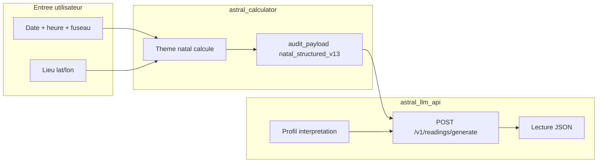

# astral_llm — Gateway LLM astrologique

Service Rust independant du moteur de calcul (`astral_calculator`). Il transforme un resultat
astrologique deja calcule en lecture interpretative structuree, securisee et interchangeable entre
fournisseurs LLM.

Le gateway n'est **pas** un simple proxy LLM : la validation metier se fait **avant** tout appel provider.

## Concepts cles

| Terme | Signification |
|---|---|
| `natal_prompter` | Produit API unique pour les lectures natales |
| `interpretation_profile_code` | Tier ou profil custom (`natal_light`, `natal_basic`, `natal_premium`, `natal_premium_plus`, …) — definit chapitres, qualite, evidence |
| `astrologer_profile` | Style redactionnel de la requete (ton, jargon) — independant du profil d'interpretation |
| `astro_result` | Payload astro calcule (`natal_structured_v13` ou `llm_projection_natal_v1`) |
| `generation_mode` | `single_pass` (1 appel) ou `chapter_orchestrated` (multi-chapitres + summary ; + chapitre `synthesis` si profil `natal_premium_plus`) — derive du profil |

```txt
Naissance (.env) -> astral_calculator -> audit_payload -> astral_llm_api + profil -> lecture JSON
```

## Table des matieres

**Prise en main**

1. [Installation et premier demarrage](#partie-i--installation-et-premier-demarrage)
2. [Tutoriel — Creer un profil d'interpretation](#tutoriel-1--creer-un-nouveau-profil-dinterpretation-pas-a-pas)
3. [Tutoriel — Naissance vers interpretation](#tutoriel-2--obtenir-une-interpretation-a-partir-de-donnees-de-naissance-pas-a-pas)
4. [Reference rapide](#partie-ii--reference-rapide)

**API et configuration**

5. [API HTTP](#partie-iii--api-http)
6. [Configuration](#partie-iv--configuration)

**Technique**

7. [Architecture](#partie-v--architecture)
8. [Qualite et securite](#partie-vi--qualite-et-securite)
9. [Exploitation](#partie-vii--exploitation)
10. [Etat du projet](#partie-viii--etat-du-projet)

---

## Partie I — Installation et premier demarrage

> Windows + PowerShell, depot sous `C:\dev\astral_calculation`, Docker pour PostgreSQL.
> Apres cette partie : **Tutoriel 2** (premiere lecture) ou **Tutoriel 1** (profil custom).

### 1. Prerequis

| Outil | Role |
|---|---|
| Rust (stable) | `cargo run -p astral_llm_api`, tests |
| Docker Desktop | PostgreSQL local (`docker compose`) |
| Cle OpenAI | Provider certifie V1 / test reel Premium (`OPENAI_API_KEY`) |
| Optionnel | `psql` en ligne de commande (sinon le script utilise `docker compose exec`) |

### 2. Fichier `.env` a la racine

```powershell
Copy-Item .env.example .env
# Editer .env : POSTGRES_PASSWORD, DATABASE_URL, OPENAI_API_KEY, ASTRAL_LLM_API_KEY
```

Variables **minimales** pour demarrer en local :

```text
DATABASE_URL=postgres://postgres:<mot-de-passe>@localhost:5432/astral
ASTRAL_LLM_ENV=local
ASTRAL_LLM_HOST=127.0.0.1
ASTRAL_LLM_PORT=8081
ASTRAL_LLM_API_KEY=<une-cle-secrete-pour-le-gateway>   # requis si l'API renvoie unauthorized
ASTRAL_LLM_ENABLE_FAKE=true                              # tests sans OpenAI
ASTRAL_LLM_ENABLE_PERSISTENCE=true                       # audit + idempotence
ASTRAL_LLM_DB_AUTO_MIGRATE=true                          # cree les tables au boot de l'API
OPENAI_API_KEY=sk-...                                    # test reel Premium
ASTRAL_LLM_DEFAULT_PROVIDER=openai
ASTRAL_LLM_DEFAULT_MODEL=gpt-5.4-mini
ASTRAL_LLM_PROMPT_LOG_DIR=output/logs/prompts
```

> **Auth** : si `ASTRAL_LLM_API_KEY` est definie, toutes les routes sauf **`GET /health`** exigent `Authorization: Bearer <cle>` ou `X-API-Key`. `/health` reste accessible sans credentials (sonde / scripts E2E).

### 3. Demarrer PostgreSQL

```powershell
docker compose up -d postgres
```

Verifier que `DATABASE_URL` pointe vers cette instance.

### 4. Enregistrer les profils d'interpretation en base

Soumettre les quatre profils fournis (detail et profil custom : **Tutoriel 1**, reference : **Partie IV**) :

```powershell
.\scripts\manage_natal_interpretation_profiles.ps1 -Submit -Path config\natal_interpretation_profiles\natal_light.json
.\scripts\manage_natal_interpretation_profiles.ps1 -Submit -Path config\natal_interpretation_profiles\natal_basic.json
.\scripts\manage_natal_interpretation_profiles.ps1 -Submit -Path config\natal_interpretation_profiles\natal_premium.json
.\scripts\manage_natal_interpretation_profiles.ps1 -Submit -Path config\natal_interpretation_profiles\natal_premium_plus.json
.\scripts\manage_natal_interpretation_profiles.ps1 -List
```

### 5. Modeles LLM (produit + profils)

```powershell
# Defauts produit en base (chapitres + summary)
.\scripts\set_product_llm_models.ps1 -Show
.\scripts\set_product_llm_models.ps1 -Product natal_prompter -Chapters gpt-5.4-mini -Summary gpt-5-nano
```

Les caps et modeles par tier viennent aussi de `chapter_models` dans chaque JSON sous `config/natal_interpretation_profiles/`.

### 6. Lancer l'API

```powershell
cargo run -p astral_llm_api
```

Attendre le log `astral_llm_api listening` sur `127.0.0.1:8081` (ou le port `ASTRAL_LLM_PORT`).

**Important** : apres modification des profils en base ou de `llm_product_models.conf`, **redemarrer** l'API pour recharger le catalogue.

### 7. Test rapide sans OpenAI (FakeProvider)

Prerequis : `ASTRAL_LLM_ENABLE_FAKE=true` **et** redemarrage de l'API apres changement.

Requete type `natal_light` (deja preparee apres un premier run) :

```powershell
.\scripts\generate_premium_reading_e2e.ps1 `
  -RequestPath output\request-fake-light.json `
  -Provider fake -Model fake-model `
  -OutputPath output\fake_reading_first.json
```

Reponse attendue : `status: success`, `used_provider: fake`, un chapitre `identity`, `generation_mode: single_pass`.

Pour **creer** `output\request-fake-light.json` a partir du minimal :

```powershell
$req = Get-Content request-premium.json -Raw | ConvertFrom-Json
$req.product_context.interpretation_profile_code = "natal_light"
$req.response_contract.generation_mode = "single_pass"
$req.engine = @{ provider = "fake"; model = "fake-model"; allow_fallback = $true; domain_count = 1 }
$req.astrologer_profile.preferred_domains = @("identity")
$req | ConvertTo-Json -Depth 20 | Set-Content output\request-fake-light.json -Encoding utf8
```

### 8. Test reel Premium (OpenAI)

Prerequis : `OPENAI_API_KEY`, payload **riche** (pas seulement `domain_scores`).

```powershell
.\scripts\generate_premium_reading_e2e.ps1 `
  -RequestPath request-premium-rich.json `
  -OutputPath output\premium_reading_real.json `
  -TimeoutSec 600
```

Reference validee (2026-06-04) : run `f79c04a7-d0ff-4d7a-b32e-42fd7fef7d80` — ~42 s, 5 chapitres `gpt-5.4-mini` + summary `gpt-5-nano`, sortie `output\premium_reading_real.json`.

Consulter le resultat :

```powershell
Get-Content output\premium_reading_real.json | ConvertFrom-Json | Select-Object status, run_id
.\scripts\show_generation_run.ps1 -RunId f79c04a7-d0ff-4d7a-b32e-42fd7fef7d80
```

Prompts envoyes au modele : `output\logs\prompts\<run_id>\`.

### 9. Test reel Premium Plus (OpenAI)

Lecture longue : 8 chapitres astro + summary court + chapitre `synthesis` integratif. Seuils profil v2 : chapitres domaine min **520** / cible **650** / max **850** mots, min **6** `astro_basis` ; `synthesis` min **520** mots et min **4** `astro_basis`.

Prerequis : `OPENAI_API_KEY`, profil `natal_premium_plus` en base (`-Submit`), API redemarree, payload **riche**, `ASTRAL_LLM_REQUEST_TIMEOUT_MS=900000` dans `.env` (sinon HTTP **504** apres ~125 s).

```powershell
# Generation + validation structure (recommande)
.\scripts\test_natal_premium_plus_profile.ps1

# Ou generation seule
.\scripts\generate_premium_plus_reading_e2e.ps1 `
  -OutputPath output\premium_plus_reading_e2e.json
```

> Timeout script par defaut **1800 s** ; aligner `ASTRAL_LLM_REQUEST_TIMEOUT_MS=900000` dans `.env` sur la duree reelle (~155 s en run certifie, marge pour repairs opening).

Options utiles du script de test :

| Parametre | Role |
|---|---|
| `-SubmitProfile` | Soumet `natal_premium_plus.json` en base avant le test |
| `-SkipGenerate` | Valide un fichier deja genere (`-OutputPath`) |
| `-UseFake` | `provider=fake` (smoke rapide ; gate 520 mots souvent en echec) |
| `-Model` / `-SummaryModel` | Surcharge ponctuelle des modeles |

Fixture : `request-premium-plus-rich.json` (copie de `request-premium-rich.json` avec `interpretation_profile_code: natal_premium_plus`, `engine.domain_count: 8`).

Reponse attendue : enveloppe `{ status: "success", run_id, reading: { chapters[], summary, quality } }` — 9 entrees dans `reading.chapters[]` (8 domaines + `synthesis`), `reading.summary.short_text` court. **10 appels LLM** en succes nominal ; les repairs ajoutent des steps supplementaires dans `execution_audit`.

Verifier la longueur et les packs :

```powershell
$r = Get-Content output\premium_plus_reading_e2e.json | ConvertFrom-Json
$reading = if ($r.reading) { $r.reading } else { $r }
$reading.chapters | ForEach-Object {
  $wc = [regex]::Matches($_.body, '\S+').Count
  "$($_.code): $wc mots, $($_.astro_basis.Count) basis"
}
.\scripts\show_generation_run.ps1 -RunId $r.run_id
```

Comparer une sortie v2 a la baseline v1 :

```powershell
.\scripts\generate_premium_plus_reading_e2e.ps1 -OutputPath output\premium_plus_reading_e2e_v2.json
.\scripts\compare_premium_plus_versions.ps1 `
  -V1Path output\premium_plus_reading_e2e.json `
  -V2Path output\premium_plus_reading_e2e_v2.json
```

---

## Tutoriel 1 — Creer un nouveau profil d'interpretation (pas a pas)

Un **profil d'interpretation** definit *comment* `astral_llm` produit une lecture : nombre de chapitres, mode de generation, modeles LLM, exigences de qualite, planner d'evidence, etc. Ce n'est **pas** un profil astrologue (ton, jargon) : celui-ci se configure dans `astrologer_profile` de la requete HTTP.

Le produit API est toujours **`natal_prompter`**. Le tier (light / basic / premium / personnalise) est choisi via **`interpretation_profile_code`**.

### Vue d'ensemble

```txt
Fichier JSON local          Script PowerShell              Base PostgreSQL           API au demarrage
config/natal_interpretation_profiles/     manage_natal_interpretation_profiles.ps1 -Submit
        |                              ------------------------>  llm_interpretation_profiles
        |                                                          (catalogue recharge)
        +--- copier / editer un modele existant
```

### Etape 0 — Prerequis

**Partie I** terminee (PostgreSQL, `.env`, API demarree). Les quatre profils fournis (`natal_light`, `natal_basic`, `natal_premium`, `natal_premium_plus`) servent de modeles.

### Etape 1 — Choisir un modele de depart

| Objectif | Copier depuis | `generation_mode` | Evidence | Gate qualite |
|---|---|---|---|---|
| Lecture rapide, 1 domaine | `natal_light.json` | `single_pass` | non | non bloquante |
| Lecture multi-chapitres standard | `natal_basic.json` | `chapter_orchestrated` | non | non bloquante |
| Lecture riche avec preuves astro | `natal_premium.json` | `chapter_orchestrated` | oui | **bloquante** |
| Lecture premium longue (8 chapitres + synthese) | `natal_premium_plus.json` | `chapter_orchestrated` | oui (min 6/ch.) | **bloquante** (min 520 mots/ch.) |

```powershell
Copy-Item config\natal_interpretation_profiles\natal_basic.json `
          config\natal_interpretation_profiles\natal_basic_custom.json
```

### Etape 2 — Definir un code unique

Ouvrir le fichier copie et modifier **`profile_code`** (identifiant utilise dans les requetes API) :

```json
"profile_code": "natal_basic_custom"
```

Contraintes : code unique, snake_case recommande, pas d'espaces. Le champ **`product_code`** doit rester `"natal_prompter"`.

### Etape 3 — Regler le mode de generation

| Champ | Valeurs | Effet |
|---|---|---|
| `generation_mode` | `single_pass` | Un seul appel LLM (profil « light ») |
| `generation_mode` | `chapter_orchestrated` | Un appel LLM par chapitre + synthese finale |
| `max_domains` / `max_chapters` | entier | Plafond domaines / chapitres autorises |
| `chapter_types` | liste de codes | Chapitres generes (ex. `identity`, `career`, `relationships`) |
| `default_domain_count` | entier | Nombre de domaines par defaut si la requete n'en fixe pas |

Pour un profil custom proche du Basic, garder `chapter_orchestrated` et ajuster `chapter_types` (ex. retirer `talents` pour raccourcir la lecture).

Pour une **sequence fixe** (comme `natal_premium_plus`, detectee quand `default_domain_count == astrological_chapter_types().len()`) : aligner `default_domain_count` sur le nombre de chapitres astro (hors `synthesis`), lister `synthesis` en dernier dans `chapter_types` pour activer `has_final_synthesis_chapter()`, et fixer `max_chapters` au total (astro + synthesis). L'ordre `chapter_types` devient contractuel : le client ne peut pas le contourner via `preferred_domains`, `engine.domain_count` ni `response_contract.chapters`. `natal_premium` n'est **pas** une sequence fixe (`default_domain_count` = 12, `chapter_types` = 9) : le nombre de chapitres suit `engine.domain_count` (defaut profil ou requete ; E2E `request-premium-rich.json` utilise `domain_count: 5`).

### Etape 4 — Configurer les modeles LLM du profil

Bloc **`chapter_models`** (obligatoire) :

```json
"chapter_models": {
  "default_provider": "openai",
  "default_model": "gpt-5.4-mini",
  "summary_model": "gpt-5-nano"
}
```

- `default_model` : modele pour chaque chapitre.
- `summary_model` : modele pour la synthese finale (mode `chapter_orchestrated` uniquement).
- Ces valeurs sont utilisees si la requete HTTP ne precise pas `engine.model` / `engine.summary_model`.

Les modeles doivent exister et etre actifs dans le catalogue base (`llm_providers` / `llm_provider_models`). En local avec `FakeProvider`, les modeles reels sont ignores si vous forcez `provider: fake`.

### Etape 5 — Regler la qualite et l'evidence

**Structure redactionnelle** (`body_structure`) — **obligatoire** si `evidence.enabled` + `quality.blocking_gate` :

| Champ | Role |
|---|---|
| `paragraph_count` | Nombre de paragraphes dans le `body` (4 = `compact_flow`, 6 = `editorial_flow`) |
| `paragraph_min_words` / `paragraph_max_words` | Bornes par paragraphe (injectees dans `ChapterWritingGuidance` et prompt `synthesis`) |
| `style` | `compact_flow` (`natal_premium`) ou `editorial_flow` (`natal_premium_plus`) — pilote `uses_rich_editorial_structure()` |

**Qualite** (`quality`) :

| Champ | Role |
|---|---|
| `blocking_gate` | `true` = echec HTTP si la prose ne passe pas les controles (`READING_QUALITY_FAILED`) |
| `min_words_per_chapter` | Longueur minimale par chapitre domaine |
| `min_astro_basis_refs_per_chapter` | Densite minimale `astro_basis` par chapitre (gate `ReadingQualityValidator`) |
| `min_interpretive_astro_basis_refs_per_chapter` | Nombre minimum de references astro interpretatives (pas seulement des scores de domaine ; gate `AstroBasisValidator`) |
| `min_words_synthesis` / `target_words_synthesis` | Seuils dedies au chapitre `synthesis` (optionnels ; defaut = `chapter_word_targets`) |
| `min_astro_basis_refs_synthesis` | Seuil `astro_basis` dedie pour `synthesis` (ex. 4 pour `natal_premium_plus`) |
| `max_repeated_trigrams` | Score repetition max par chapitre (comptage perceptuel cote Rust) |
| `require_disclaimer` | Disclaimer legal obligatoire dans la reponse |

Seuil effectif gate qualite : `max(min_astro_basis_refs_per_chapter, evidence.policy.min_evidence_per_chapter)` pour les chapitres domaine ; pour `synthesis`, `min_astro_basis_refs_synthesis` et `min_words_synthesis` si presents. `InterpretationProfile::validate()` verifie la coherence (`body_structure.style`, bornes synthesis ≤ `chapter_word_targets.max`).

**Evidence** (`evidence`) :

- `enabled: false` — pas de planner de preuves (Basic / Light).
- `enabled: true` + bloc `policy` — planner Premium (diversite des preuves, minimums par chapitre). N'activer que si le payload astro est **riche** (positions, signaux, aspects — pas seulement `domain_scores`).

**Consigne redactionnelle** : champ `task_fragment` (texte injecte dans le prompt de chaque chapitre).

### Etape 6 — Enregistrer le profil en base

```powershell
.\scripts\manage_natal_interpretation_profiles.ps1 `
  -Submit -Path config\natal_interpretation_profiles\natal_basic_custom.json
```

Le script :

1. Cree la table `llm_interpretation_profiles` si necessaire.
2. Valide les champs obligatoires du JSON.
3. Insere ou met a jour la ligne (`ON CONFLICT` sur `profile_code`).

Verifier :

```powershell
.\scripts\manage_natal_interpretation_profiles.ps1 -List
.\scripts\manage_natal_interpretation_profiles.ps1 -Get -ProfileCode natal_basic_custom
```

### Etape 7 — Redemarrer l'API

Le catalogue des profils est charge **au demarrage** de `astral_llm_api`. Apres chaque `-Submit`, `-Delete` ou modification de `config/llm_product_models.conf` :

```powershell
# Arreter l'instance en cours (Ctrl+C), puis :
cargo run -p astral_llm_api
```

Attendre le log `astral_llm_api listening`.

### Etape 8 — Tester le nouveau profil

Dans une requete `POST /v1/readings/generate`, renseigner :

```json
"product_context": {
  "product_code": "natal_prompter",
  "interpretation_profile_code": "natal_basic_custom",
  "user_language": "fr",
  "audience_level": "beginner"
}
```

Le champ `response_contract.generation_mode` peut etre omis : l'API le **corrige** pour correspondre au profil.

Test rapide sans OpenAI (FakeProvider, `ASTRAL_LLM_ENABLE_FAKE=true`) :

```powershell
$req = Get-Content request-premium-rich.json -Raw | ConvertFrom-Json
$req.product_context.interpretation_profile_code = "natal_basic_custom"
$req | ConvertTo-Json -Depth 20 | Set-Content output\request-custom.json -Encoding utf8

.\scripts\generate_premium_reading_e2e.ps1 `
  -RequestPath output\request-custom.json `
  -Provider fake -Model fake-model `
  -OutputPath output\reading_custom.json
```

Reponse attendue : `status: success`, chapitres listes dans `chapter_types` du profil.

### Etape 9 — Desactiver ou supprimer un profil

```powershell
# Soft-delete (recommande) :
.\scripts\manage_natal_interpretation_profiles.ps1 -Delete -ProfileCode natal_basic_custom

# Suppression physique :
.\scripts\manage_natal_interpretation_profiles.ps1 -Delete -ProfileCode natal_basic_custom -Hard
```

Puis redemarrer `astral_llm_api`.

### Champs obligatoires du JSON (checklist)

Le script `-Submit` rejette le fichier si l'un de ces champs manque :

`profile_code`, `product_code`, `generation_mode`, `max_domains`, `max_chapters`, `max_output_tokens`, `max_reasoning_effort`, `chapter_models`, `chapter_word_targets`, `quality`, `evidence` — plus `chapter_models.default_model` et, si `evidence.enabled` est `true`, `evidence.policy`.

Le script `-Submit` ne verifie pas encore tous les champs metier. A l'**ingestion API** (`InterpretationProfile::validate()`), si `evidence.enabled` + `quality.blocking_gate` : `body_structure` est **obligatoire**. Pour `natal_premium_plus` : renseigner aussi `chapter_types` (avec `synthesis` en dernier), `default_domain_count` (= nombre de chapitres astro), et les seuils synthesis (`min_words_synthesis`, `min_astro_basis_refs_synthesis`) si differents des chapitres domaine.

---

## Tutoriel 2 — Obtenir une interpretation a partir de donnees de naissance (pas a pas)

Ce tutoriel enchaine **deux services** :

1. **`astral_calculator`** — calcule le theme natal a partir de la date, heure, fuseau et lieu de naissance.
2. **`astral_llm_api`** — transforme ce resultat en texte interpretatif via un LLM.



### Etape 0 — Prerequis

**Partie I** doit etre terminee (PostgreSQL, `.env`, profils en base, API demarree). Variables **naissance** supplementaires dans `.env` (exemple Paris, 2 janvier 1990, 04:04 heure locale) :

```text
ASTRAL_SUBJECT_LABEL=Marie Dupont
ASTRAL_BIRTH_DATE=1990-01-02
ASTRAL_BIRTH_TIME=04:04:05
ASTRAL_BIRTH_TIMEZONE=Europe/Paris
ASTRAL_LATITUDE_DEG=48.8566
ASTRAL_LONGITUDE_DEG=2.3522
ASTRAL_LOCATION_LABEL=Paris, France
ASTRAL_PRODUCT_CODE=basic
ASTRAL_PROJECTION_LEVEL=rich
```

> Les trois variables `ASTRAL_BIRTH_DATE`, `ASTRAL_BIRTH_TIME` et `ASTRAL_BIRTH_TIMEZONE` doivent etre **toutes** renseignees ensemble. Alternative legacy : `ASTRAL_BIRTH_DATETIME_UTC` (fuseau defaut UTC).

### Etape 1 — Calculer le theme natal

Depuis la racine du depot :

```powershell
cargo run -p astral_calculator --features swisseph-engine -- --file
```

Sortie : un fichier `output\astro_engine_response_YYYYMMDD_HHMMSS.json` contenant :

| Cle | Contenu |
|---|---|
| `audit_payload.contract_version` | Toujours `natal_structured_v13` |
| `audit_payload.payload` | **Donnees astro completes** (positions, signaux, scores, etc.) |
| `llm_payload` | Projection epuree `llm_projection_natal_v1` (optionnelle pour l'API) |

Pour l'interpretation, utiliser **`audit_payload.payload`** dans la requete LLM (plus riche ; requis pour le profil Premium).

Verification rapide :

```powershell
$engine = Get-ChildItem output\astro_engine_response_*.json | Sort-Object LastWriteTime -Descending | Select-Object -First 1
$doc = Get-Content $engine.FullName -Raw | ConvertFrom-Json
$doc.calculation_result.status          # doit etre "completed"
$doc.audit_payload.contract_version     # "natal_structured_v13"
$doc.audit_payload.payload.positions.Count  # > 0 si calcul OK
```

### Etape 2 — Choisir le profil d'interpretation

| Profil | Quand l'utiliser | Provider sans cle |
|---|---|---|
| `natal_light` | Apercu rapide, 1 chapitre (`identity`) | `fake` OK |
| `natal_basic` | Lecture complete mais gate qualite souple | `fake` OK |
| `natal_premium` | Lecture riche compacte (1–9 chapitres selon `engine.domain_count`, E2E : 5 ; ~150–300 mots/ch.) | OpenAI requis (payload riche) |
| `natal_premium_plus` | Lecture expert web (8 chapitres astro + `synthesis`, sequence fixe ; ~650 mots/ch. cible, min 520, 6+ preuves/ch.) | OpenAI requis (payload riche) |

Pour un **premier test gratuit**, choisir `natal_light` ou `natal_basic`. Pour la **qualite produit**, `natal_premium` ou `natal_premium_plus` + `OPENAI_API_KEY`.

Benchmark E2E premium plus :

```powershell
.\scripts\generate_premium_plus_reading_e2e.ps1
# fixture : request-premium-plus-rich.json
# sortie  : output\premium_plus_reading_e2e.json
```

### Etape 3 — Construire la requete HTTP

Script dedie (lit le dernier `output\astro_engine_response_*.json` par defaut) :

```powershell
.\scripts\build_reading_request_from_engine.ps1 `
  -ProfileCode natal_basic `
  -UseFake `
  -OutputPath output\my_reading_request.json
```

Parametres utiles :

| Parametre | Defaut | Role |
|---|---|---|
| `-EnginePath` | dernier fichier `output\astro_engine_response_*.json` | Enveloppe moteur a convertir |
| `-ProfileCode` | `natal_basic` | Profil d'interpretation |
| `-UseFake` | desactive | Force `provider=fake` (test sans OpenAI) |
| `-Provider` / `-Model` | — | Surcharge ponctuelle du moteur LLM |
| `-UserLanguage` | `fr` | Langue de la lecture |
| `-OutputPath` | `output\my_reading_request.json` | Fichier requete genere |

Exemple avec un fichier moteur precis et profil Premium (OpenAI) :

```powershell
.\scripts\build_reading_request_from_engine.ps1 `
  -EnginePath output\astro_engine_response_20260605_120000.json `
  -ProfileCode natal_premium
```

Points importants :

- **`interpretation_profile_code`** est obligatoire pour `natal_prompter`.
- **`astro_result.data`** = copie integrale de `audit_payload.payload` (pas l'enveloppe entiere).
- **`astrologer_profile`** influence le style, pas la structure des chapitres (definie par le profil).
- Ne pas mettre la date de naissance en clair dans `custom_instructions` : le normalizer redige les PII.

### Etape 4 — Envoyer la requete a l'API

**Option A — Script E2E (recommande en local)** :

```powershell
.\scripts\generate_premium_reading_e2e.ps1 `
  -RequestPath output\my_reading_request.json `
  -OutputPath output\my_reading_result.json `
  -TimeoutSec 600
```

Avec OpenAI : omettre `-Provider fake` (utilise les modeles du profil / base).

**Option B — Appel HTTP direct** :

```powershell
$headers = @{
  "Content-Type" = "application/json"
  "Authorization" = "Bearer $env:ASTRAL_LLM_API_KEY"
  "Idempotency-Key" = "ma-lecture-$(Get-Date -Format 'yyyyMMddHHmmss')"
}
$body = Get-Content output\my_reading_request.json -Raw
Invoke-RestMethod -Method POST `
  -Uri "http://127.0.0.1:8081/v1/readings/generate" `
  -Headers $headers -Body $body
```

> Si `ASTRAL_LLM_API_KEY` est defini dans `.env`, le header `Authorization` est **obligatoire** (y compris pour les tests locaux).

### Etape 5 — Lire le resultat

```powershell
$result = Get-Content output\my_reading_result.json -Raw | ConvertFrom-Json
$result.status                    # "success"
$result.run_id                    # UUID pour audit
$result.reading.chapters          # tableau des chapitres generes
$result.reading.summary           # synthese (si chapter_orchestrated)
```

Fichiers de debug :

| Chemin | Contenu |
|---|---|
| `output\logs\prompts\<run_id>\` | Prompts envoyes au modele (un fichier par chapitre) |
| `output\logs\premium_reading_e2e_*.json` | Journal client du script E2E |
| `.\scripts\show_generation_run.ps1 -RunId <uuid>` | Audit SQL (si persistence activee) |

### Etape 6 — Chainer calcul + interpretation (script unique)

Pour automatiser les etapes 1, 3 et 4 :

```powershell
cargo run -p astral_calculator --features swisseph-engine -- --file

.\scripts\build_reading_request_from_engine.ps1 -ProfileCode natal_basic -UseFake

.\scripts\generate_premium_reading_e2e.ps1 `
  -RequestPath output\my_reading_request.json `
  -OutputPath output\my_reading_result.json
```


### Variante : reutiliser un golden existant

Sans recalculer, vous pouvez tester l'API avec `request-premium-rich.json` (theme Paris 1990 deja calcule). Utile pour valider l'installation LLM avant de brancher vos propres naissances :

```powershell
.\scripts\generate_premium_reading_e2e.ps1 -RequestPath request-premium-rich.json
```

---

---

## Partie II — Reference rapide

### Scripts principaux

| Script | Role |
|---|---|
| `scripts/build_reading_request_from_engine.ps1` | Construit la requete LLM depuis `astro_engine_response_*.json` |
| `scripts/generate_premium_reading_e2e.ps1` | Client E2E local (`POST /v1/readings/generate`) |
| `scripts/manage_natal_interpretation_profiles.ps1` | CRUD profils d'interpretation en base |
| `scripts/set_product_llm_models.ps1` | Modeles LLM par produit en base |
| `scripts/show_generation_run.ps1` | Audit d'un run (`GET /v1/runs/{run_id}`) |

### Fichiers et payloads de test

| Fichier / dossier | Role |
|---|---|
| `request-premium.json` | Payload astro minimal (tests negatifs Premium) |
| `request-premium-rich.json` | Golden E2E Premium (payload complet) |
| `config/natal_interpretation_profiles/*.json` | Source des profils (Submit en base) |
| `astral_llm/prompts/natal_prompter/v1/` | Prompts communs versionnes |
| `scripts/build_reading_request_from_engine.ps1` | Construit la requete LLM depuis `astro_engine_response_*.json` |
| `scripts/generate_premium_reading_e2e.ps1` | Client E2E local |
| `scripts/manage_natal_interpretation_profiles.ps1` | CRUD profils en base |

---

### Depannage frequents

| Symptome | Cause probable | Action |
|---|---|---|
| `unauthorized` | `ASTRAL_LLM_API_KEY` manquant dans la requete | Header `Authorization: Bearer ...` |
| `UNSUPPORTED_PROVIDER` + `fake` | `ASTRAL_LLM_ENABLE_FAKE=false` | Passer a `true`, redemarrer l'API |
| `PREMIUM_EVIDENCE_DIVERSITY_FAILED` | Profil `natal_premium` + payload trop pauvre | Utiliser `request-premium-rich.json` ou profil `natal_light` |
| `interpretation profile not found` | Profils non soumis en base | `manage_natal_interpretation_profiles.ps1 -Submit` |
| `relation llm_interpretation_profiles does not exist` | Table absente | Relancer le script `-Submit` (cree le schema) ou demarrer l'API avec `DB_AUTO_MIGRATE=true` |
| Aucun step dans l'audit script | Persistence desactivee ou run fake tres court | Normal en dev ; activer `ENABLE_PERSISTENCE` pour l'historique SQL |

Erreurs supplementaires (flux naissance → interpretation) :

| Message | Cause | Solution |
|---|---|---|
| `PREMIUM_EVIDENCE_DIVERSITY_FAILED` | Profil Premium + payload trop pauvre | `natal_basic` ou `ASTRAL_PROJECTION_LEVEL=rich` |
| `READING_QUALITY_FAILED` | Gate bloquante Premium | Relancer ou passer en `natal_basic` |
| Echec calculateur | PostgreSQL ou ephemerides | `docker compose ps`, `ASTRAL_EPHEMERIS_PATH` |

---

## Partie III — API HTTP

### Endpoints

| Methode | Route | Description |
|---|---|---|
| GET | `/health` | Sante (hors rate limit, **sans auth** si gateway key active) |
| POST | `/v1/readings/generate` | Generation lecture |
| POST | `/v1/readings/validate` | Validation JSON vs schema |
| GET | `/v1/runs/{run_id}` | Audit run + steps (PostgreSQL requis) |
| GET | `/v1/providers` | Capacites modeles + `circuit_breakers` |
| GET | `/v1/schemas/{version}` | Schema JSON (ex. `natal_reading_v1`) |

### Contrat `POST /v1/readings/generate`

> Assemblage requete depuis le calculateur : **Tutoriel 2** ; script : `build_reading_request_from_engine.ps1`.

Corps JSON (extrait) :

```json
{
  "product_context": {
    "product_code": "natal_prompter",
    "interpretation_profile_code": "natal_premium",
    "user_language": "fr",
    "audience_level": "beginner"
  },
  "astro_result": {
    "contract_version": "natal_structured_v13",
    "chart_type": "natal",
    "data": { }
  },
  "astrologer_profile": { "tone": "warm", "jargon_level": "beginner", "wording_style": "clear" },
  "engine": { "allow_fallback": true },
  "response_contract": {
    "output_schema_version": "natal_reading_v1",
    "generation_mode": "chapter_orchestrated",
    "format": "structured_json",
    "include_astro_sources": true,
    "include_legal_disclaimer": true
  }
}
```

- `interpretation_profile_code` est **obligatoire** pour `natal_prompter`.
- `generation_mode` peut etre corrige automatiquement pour correspondre au profil.
- Anciens clients : `product_code: natal_premium` ou `natal_basic` sont migres vers `natal_prompter` + profil deduit.

Appel PowerShell avec auth :

```powershell
$headers = @{
  "Content-Type" = "application/json"
  "Authorization" = "Bearer $env:ASTRAL_LLM_API_KEY"
  "Idempotency-Key" = "demo-$(Get-Date -Format 'yyyyMMddHHmmss')"
}
$body = Get-Content request-premium-rich.json -Raw
Invoke-RestMethod -Method POST -Uri "http://127.0.0.1:8081/v1/readings/generate" -Headers $headers -Body $body
```

### Idempotence

- Header `Idempotency-Key` ou champ `idempotency_key`
- Table `llm_idempotency_records` (PostgreSQL)
- Flux transactionnel : `SELECT ... FOR UPDATE` puis insert/update dans `claim_idempotency` (evite la course double-insert)
- Finalisation : `finalize_idempotency` apres generation
- Protection : `input_hash` sur payload **redige** (`redact_request_for_storage`), rejeu reponse terminale, reclaim apres `failed` / `safety_rejected`, conflit si payload different (`IDEMPOTENCY_PAYLOAD_MISMATCH`)
- `run_id` API = `run_id` reponse (pas de divergence)
- **Production publique** : cle idempotence **obligatoire** ; echec du store => **503** (fail closed, pas de generation sans verrou)

Sans persistence, l'idempotence **n'est pas** durable entre processus.

---

## Partie IV — Configuration

### Profils d'interpretation fournis

| `interpretation_profile_code` | `generation_mode` | Evidence | Gate qualite | Usage |
|---|---|---|---|---|
| `natal_light` | `single_pass` | non | non bloquante | 1 domaine, rapide |
| `natal_basic` | `chapter_orchestrated` | non | non bloquante | multi-chapitres standard |
| `natal_premium` | `chapter_orchestrated` | oui (min 4/ch.) | **bloquante** (min 40 mots/ch.) | compact (`body_structure` 4 §) ; nombre de chapitres variable (`domain_count`) |
| `natal_premium_plus` | `chapter_orchestrated` | oui (min 6/ch.) | **bloquante** (min 520 mots/ch., synthesis 520 / 4 basis) | sequence fixe : 8 domaines + `synthesis` ; `body_structure` 6 § (`editorial_flow`) |

Creation d'un profil personnalise : **Tutoriel 1**. Soumission initiale :

```powershell
.\scripts\manage_natal_interpretation_profiles.ps1 -Submit -Path config\natal_interpretation_profiles\natal_light.json
.\scripts\manage_natal_interpretation_profiles.ps1 -Submit -Path config\natal_interpretation_profiles\natal_basic.json
.\scripts\manage_natal_interpretation_profiles.ps1 -Submit -Path config\natal_interpretation_profiles\natal_premium.json
.\scripts\manage_natal_interpretation_profiles.ps1 -Submit -Path config\natal_interpretation_profiles\natal_premium_plus.json
.\scripts\manage_natal_interpretation_profiles.ps1 -List
```

### Modeles LLM par produit

Configuration operationnelle (sans toucher au code Rust) :

| Etape | Commande |
|---|---|
| 1. Editer | `config/llm_product_models.conf` — une ligne `natal_prompter` ; modeles par tier dans `config/natal_interpretation_profiles/*.json` (`chapter_models`) |
| 2. Appliquer | `.\scripts\set_product_llm_models.ps1` |
| 3. Redemarrer | `astral_llm_api` (catalogue recharge au boot) |
| Verifier | `.\scripts\set_product_llm_models.ps1 -Show` |

Exemple fichier :

```text
natal_prompter	gpt-5.4-mini	gpt-5-nano	openai
```

Exemple CLI (sans modifier le fichier) :

```powershell
.\scripts\set_product_llm_models.ps1 -Product natal_prompter -Chapters gpt-5.4-mini -Summary gpt-5-nano
.\scripts\manage_natal_interpretation_profiles.ps1 -Submit -Path config\natal_interpretation_profiles\natal_premium.json
```

Comportement runtime :

- **Chapitres** : colonne SQL `default_model` (si `engine.model` absent de la requete).
- **Summary** : colonne SQL `economic_model` (si `engine.model` absent).
- **Test ponctuel** (sans changer la base) : `engine.model`, `engine.summary_model`, ou `generate_premium_reading_e2e.ps1 -Model` / `-SummaryModel`.

Valeurs Premium actuelles (2026-06-04) : chapitres `gpt-5.4-mini`, summary `gpt-5-nano`.

### Referentiels canoniques (base)

Tables (ou bootstrap si DB vide) :

- `llm_astrological_domains`
- `llm_safety_content_patterns`
- `llm_product_prompt_profiles`
- `llm_providers` — moteurs LLM (`provider_code`, `is_active`) ; liste modifiable
- `llm_provider_models` — modeles par moteur (`is_active` = utilisable en production) ; jointure `provider_id` → `llm_providers`
- `ProviderCatalogRepository` (infra) : `list_providers`, `add_provider`, `delete_provider`, `set_provider_active`, `list_models`, `add_model`, `delete_model`, `set_model_active`
- Au boot : `load_active_provider_codes` + `load_model_capabilities` → `ModelCapabilityRegistry::from_db_catalog`
- Avant prompt : `validate_engine_in_catalog` (moteur actif + modele actif dans le catalogue)
- `llm_model_usage_tiers` — profils : `production_candidate`, `baseline`, `subtask_candidate`, `benchmark_compare`, `oracle_only`
- `llm_generation_benchmark_usages` + `llm_generation_benchmark_usage_models` — matrice usage ↔ modeles recommandes
- Seeds OpenAI (vague 1 + vague 2) : tous actifs ; tiers voir SQL ; E2E Premium : `scripts/benchmark_premium_e2e_models.ps1` (5 runs, `-MaxOutputTokens 4096` par defaut, `-IncludeOracle` pour gpt-5.5-pro avec `engine.allow_oracle_benchmark`)
- Apres benchmark : `scripts/summarize_benchmark_runs.ps1` lit le JSONL resume, appelle `GET /v1/runs/{run_id}`, estime le cout (grille OpenAI de reference dans le script) et exporte `benchmark_metrics_<stamp>.csv` + JSONL enrichi (colonnes `manual_*` a remplir a la main)
- Modeles reasoning : `reasoning_output_reserve_min`, `reasoning_effort_subtask` / `_primary` / `_oracle` (litteraux API par modele, ex. gpt-5-mini subtask=`minimal`, gpt-5.4+ subtask=`none`) ; module `reasoning_generation`
- OpenAI Responses API (GPT-5) : `openai_adapter` agrege les blocs `output[].type=message`
- Validation contexte : `PrimaryReading` (chapitres), `Subtask` (summary/repair), `OracleBenchmark` (oracle explicite)
- `llm_interpretation_profiles` — profils JSON (`profile_code`, caps, evidence, quality, `chapter_models`)
- `llm_product_allowed_models` — modeles autorises par `product_code` (`natal_prompter`). Liste vide en politique = pas de filtre modele
- `llm_product_default_engine` — `default_model` (chapitres), `economic_model` (summary) ; voir section **Modeles LLM par produit**
- `llm_product_generation_policies`
- `llm_chapter_evidence_exclusions` — regles d'exclusion evidence par chapitre (bootstrap + chargement DB ; ex. Soleil hors `identity`, MC ruler hors `relationships`)
- `llm_element_balance_labels`, `llm_modality_balance_labels`, `llm_sect_labels`, `llm_house_theme_labels` — libelles humanises post-LLM (`AstroLabelHumanizer`)

Les valeurs metier ne sont pas dupliquees en constantes Rust lorsqu'elles existent en base.

### Variables d'environnement

| Variable | Defaut (local) | Description |
|---|---|---|
| `ASTRAL_LLM_ENV` | `local` | Profil `local` / `test` / `production` |
| `ASTRAL_LLM_PRODUCTION_MODE` | `internal` | `internal` ou `public` (niveau d'exposition prod) |
| `ASTRAL_LLM_HOST` | `127.0.0.1` | Bind host |
| `ASTRAL_LLM_PORT` | `8081` | Bind port |
| `ASTRAL_LLM_API_KEY` | — | Auth gateway ; obligatoire en production |
| `ASTRAL_LLM_PROMPTS_DIR` | `astral_llm/prompts` | Repertoire des prompts versionnes |
| `ASTRAL_LLM_DEFAULT_PROVIDER` | `fake` (local) | Provider si absent de la requete |
| `ASTRAL_LLM_DEFAULT_MODEL` | `fake-model` (local) | Modele si absent de la requete |
| `ASTRAL_LLM_ENABLE_FAKE` | `true` (local) | FakeProvider (interdit en production) |
| `ASTRAL_LLM_FALLBACK_ENABLED` | `true` | Active le fallback transitoire |
| `ASTRAL_LLM_FALLBACK_PROVIDERS` | *(vide)* | Chaine explicite ; aucune priorite OpenAI imposee |
| `ASTRAL_LLM_FALLBACK_MAX_RETRIES` | `1` | Retries par provider avant fallback suivant |
| `ASTRAL_LLM_ALLOW_CROSS_PROVIDER_FALLBACK` | `false` | Fallback inter-vendors (privacy) |
| `ASTRAL_LLM_ENABLE_PERSISTENCE` | `false` | Audit PostgreSQL + idempotence |
| `ASTRAL_LLM_DB_AUTO_MIGRATE` | `true` (local) | **Interdit** en production |
| `ASTRAL_LLM_STORE_SANITIZED_PAYLOADS` | `false` | Persiste payloads rediges dans `llm_generation_payloads` |
| `ASTRAL_LLM_ALLOW_PUBLIC_BIND` | `false` | Requis pour ecouter sur `0.0.0.0` en production |
| `ASTRAL_LLM_MAX_CONCURRENT_REQUESTS` | `32` | Semaphore global (429 si sature) |
| `ASTRAL_LLM_MAX_CONCURRENT_REQUESTS_PER_KEY` | `8` | Concurrent par cle API |
| `ASTRAL_LLM_MAX_REQUESTS_PER_MINUTE_PER_KEY` | `120` | RPM par cle API |
| `ASTRAL_LLM_MAX_PREMIUM_RUNS_PER_KEY` | `4` | Premium concurrent par cle |
| `ASTRAL_LLM_IDEMPOTENCY_TTL_HOURS` | `24` | TTL enregistrements idempotence |
| `ASTRAL_LLM_CIRCUIT_BREAKER_FAILURES` | `5` | Echecs consecutifs avant circuit ouvert |
| `ASTRAL_LLM_CIRCUIT_BREAKER_OPEN_SECS` | `60` | Duree circuit ouvert |
| `ASTRAL_LLM_MAX_BODY_BYTES` | `2097152` | Taille max body HTTP |
| `ASTRAL_LLM_MAX_ASTRO_JSON_BYTES` | `524288` | Taille max JSON astro |
| `ASTRAL_LLM_MAX_DOMAIN_COUNT` | `12` | Plafond domaines par requete |
| `ASTRAL_LLM_REQUEST_TIMEOUT_MS` | `120000` | Timeout requete HTTP (+ marge layer) |
| `OPENAI_API_KEY` | — | Cle OpenAI |
| `OPENAI_BASE_URL` | `https://api.openai.com` | URL API OpenAI |
| `OPENAI_DEFAULT_MODEL` | — | Alias repli pour `ASTRAL_LLM_DEFAULT_MODEL` |
| `ANTHROPIC_API_KEY` | — | Cle Anthropic |
| `ANTHROPIC_BASE_URL` | `https://api.anthropic.com` | URL API Anthropic |
| `MISTRAL_API_KEY` | — | Cle Mistral |
| `MISTRAL_BASE_URL` | `https://api.mistral.ai` | URL API Mistral |
| `DATABASE_URL` | — | PostgreSQL (obligatoire si persistence ou prod publique) |

Declaration complete : `.env` / `.env.example` a la racine du depot.

### Profils d'environnement

#### `local` / `test`

- Bind `127.0.0.1` par defaut
- `FakeProvider` autorise sans cle provider externe
- Auto-migrate PostgreSQL possible (`ENABLE_PERSISTENCE` + `DB_AUTO_MIGRATE`)
- Idempotence active uniquement si persistence active (sinon pas de deduplication durable)

#### `production` — mode `internal`

- `ASTRAL_LLM_API_KEY` obligatoire
- Au moins une cle provider reelle (OpenAI requis pour la V1 certifiee ; Anthropic / Mistral optionnels, certification reportee)
- `ASTRAL_LLM_ENABLE_FAKE=false`
- `ASTRAL_LLM_DB_AUTO_MIGRATE=false` ; migrations SQL appliquees **hors runtime**
- `verify_schema()` au boot si persistence sans auto-migrate
- Persistence **optionnelle** (V1 interne / reseau restreint)

#### `production` — exposition publique

Declenchee si `ASTRAL_LLM_PRODUCTION_MODE=public` **ou** `ASTRAL_LLM_ALLOW_PUBLIC_BIND=true` (defaut `public` si bind public sans mode explicite).

Regles supplementaires (`ConfigValidator`) :

- `ASTRAL_LLM_ENABLE_PERSISTENCE=true` **obligatoire**
- `DATABASE_URL` **obligatoire**
- Idempotence robuste et audit steps dependent de PostgreSQL

Critere d'acceptation boot : `ENV=production` + exposition publique + `ENABLE_PERSISTENCE=false` => **refus au demarrage**.

---

## Partie V — Architecture

### Architecture

```txt
astral_llm/
  crates/
    astral_llm_domain/       — contrats (request/response, safety, policies, capabilities)
    astral_llm_application/  — use cases, orchestration, validation, router
    astral_llm_providers/    — adapters OpenAI, Anthropic, Mistral, Fake
    astral_llm_infra/        — config, secrets, persistence, referentiel, redaction
    astral_llm_api/          — serveur HTTP Axum (lib + binaire ; auth, rate limits, routes)
  prompts/
    natal_prompter/v1/       — prompts communs (system, format, safety, task fragments par profil)
  config/natal_interpretation_profiles/  — JSON canoniques (light, basic, premium)
  scripts/manage_natal_interpretation_profiles.ps1  — Submit / List / Get / Delete en base
  crates/astral_llm_infra/sql/
    llm_generation_runs.sql  — runs, payloads, index
    llm_canonical.sql        — referentiels LLM (domains, safety, policies, models)
    llm_evidence_canonical.sql — kinds, slots chapitre, policies Premium, requirements
    llm_audit_extensions.sql — steps, idempotence
```

### Chaine gateway complete (Premium chapter_orchestrated)

```txt
InterpretationProfileResolver::normalize_request (shim legacy + generation_mode)
  -> RequestValidator
  -> ProductPolicyValidator (politique effective = profil)
  -> ModelCapabilityRegistry
  -> AstroPayloadNormalizer
  -> InterpretiveEvidenceBuilder
  -> ChapterEvidencePlanner
  -> EvidenceDiversityValidator::validate_packs (pre-LLM, Premium)
  -> SafetyResolver / SafetyGuard (pre requete)
  -> PromptCompiler (ChapterEvidencePack par chapitre — pas la reserve globale)
  -> prompt_trace (fichier + tracing : prompt compile envoye au provider)
  -> ProviderSchemaCompiler
  -> ProviderRouter (+ ProviderCircuitBreaker)
  -> LLM
  -> post-traitement chapitre (par chapitre, pendant generation) :
     AstroBasisRoleNormalizer → ChapterEvidenceBasisEnricher (CORE + SUPPORTING sauf identity + NUANCE)
     → AstroBasisRoleNormalizer → AstroLabelHumanizer
     → AstroBasisValidator → ChapterEvidenceCoherence
     (repairs LLM : min_words, repetition, repair_evidence si orphelins body / incoherence non enrichissable)
  -> SummarySynthesizer (summary court)
  -> [natal_premium_plus] FinalSynthesisSynthesizer (chapitre `synthesis`, retry min_words x2 : ExpandSameChapter puis RewriteChapter ; repair repetition si seuil depasse)
  -> repair_opening_duplicates (jusqu'a 8 tours, **un** chapitre par tour — violations **chapter opening** uniquement)
  -> EvidenceDiversityValidator::validate_reading (post-LLM, Premium)
  -> ReadingOpeningDiversityValidator::validate (bloquant sur amorces chapitre ; warnings log pour paragraphe / stock)
  -> ResponseValidator (lecture complete + summary)
  -> SafetyGuard (post)
  -> ReadingQualityValidator (bloquant si profil `blocking_gate`)
  -> Persistence / audit (evidence_metrics dans steps si Premium)
```

Codes erreur dedies :

- `PREMIUM_EVIDENCE_DIVERSITY_FAILED` — pool/payload insuffisant ou packs trop repetitifs
- `ASTRO_BASIS_INVALID` — fact_id hors pack ; `ChapterEvidenceCoherence` : planete citee dans le `body` sans `astro_basis` (y compris `dominant_planet:*` via `evidence_fact_parse`), ou slots pack encore absents apres enrichisseur. Repair LLM `repair_evidence` une fois. **Avant** coherence : `ChapterEvidenceBasisEnricher` injecte les CORE, SUPPORTING (**sauf** `identity`, avec filtre Soleil) et NUANCE manquants — evite un 2e appel LLM quand seuls des `fact_id` manquent
- `READING_QUALITY_FAILED` — qualite redactionnelle

Fixtures E2E :

- `request-premium-minimal.json` — test negatif (trio asc/sun/moon)
- `request-premium-rich.json` — golden `natal_payload_v13_paris_1990` pour E2E OpenAI (`natal_premium`)
- `request-premium-plus-rich.json` — meme golden, profil `natal_premium_plus` (lecture longue)

SQL : [`astral_llm/crates/astral_llm_infra/sql/llm_evidence_canonical.sql`](astral_llm/crates/astral_llm_infra/sql/llm_evidence_canonical.sql) (`llm_chapter_evidence_slots`, `llm_evidence_requirements`, `llm_chapter_evidence_exclusions`) ; i18n : [`llm_i18n_canonical.sql`](astral_llm/crates/astral_llm_infra/sql/llm_i18n_canonical.sql) (`llm_writing_locales` fr/en/es/de, `llm_astro_basis_roles`, `llm_aspect_type_labels`, labels balance/modality/sect/maisons)

**Langue de reponse LLM** : `OUTPUT_LANGUAGE` injecte dans les instructions systeme (`WritingLanguageDirective`) selon `product_context.user_language`. Le bloc `--- BEGIN ASTRO DATA ---` envoye au modele utilise des libelles humanises (`AstroPayloadNormalizer::to_chapter_evidence_pack_block` + `AstroLabelHumanizer::label_for_fact_id`). Post-LLM : `AstroBasisRoleNormalizer` (2 passages autour de `ChapterEvidenceBasisEnricher`) puis `AstroLabelHumanizer` sur `astro_basis` (label, factor). Roles : correspondance exacte `fact_id` puis alias `object_code` **dans la meme famille** (`evidence_fact_parse::fact_id_role_bucket` : ex. `signal:object_position:sun` ≠ `placement:sun:*`).

**ChapterEvidencePlanner** (`chapter_evidence_planner.rs`, catalogue `evidence_canonical.rs` / SQL) :

- `semantic_fact_key` sur chaque `InterpretiveEvidence` ; overlap, `avoid_repeating`, exclusions via `PriorChapterUsage` (cles semantiques, pas `fact_id` bruts).
- Extracteur : `ascendant_ruler`, `mc_ruler`, `descendant_ruler` (payload v13), `dominant_house_rulers` → `house_ruler` avec `source_house_number` sur les angles (`astro_fact_extractor.rs`).
- Slot `relationships` : `house_ruler` + `object_code` **`descendant`** ; requirement bloquant `relationships_ruler_7` ; exclusion canonique `relationships_no_mc_ruler` (`llm_chapter_evidence_exclusions`).
- Slot `career` : `house_ruler` + `mc` ; requirement `career_ruler_10`.
- Identity : exclusion `identity_no_sun` (Soleil reserve `career`) ; `EvidenceCanonicalCatalog::excludes_candidate()`.
- `family_roots` / `communication_mind` : exclusions fillers globaux et `house_axis` via table canonique (pas de constantes en code).
- `inject_blocking_requirements`, `fill_minimums` (familles aspect / house_ruler / dignite), validation adaptative (warning si pool pauvre).
- Profil `natal_premium_plus` : slots `resources` (maison 2), `family_roots` (maison 4 / IC / Lune en supporting — Lune reste **core** dans `emotional_life`), `communication_mind` (Mercure / maison 3), `synthesis` (`dominant_planet`, `element_balance`, `modality_balance`, `house_emphasis`, `house_axis`, `sect_condition` via `chart_emphasis` dans `astro_fact_extractor.rs`). Requirement `synthesis_global_dominants` en **warning** si dominantes absentes du pool.
- `pool_richness_check(pool, policy, chapter_count)` : minimum pool = `min_evidence_per_chapter × min(chapter_count, 6).max(3)` faits interpretatifs (ex. premium plus : 6 × 6 = 36).

**Post-traitement basis** (`chapter_evidence_basis_enricher.rs`) :

- **CORE** manquants : injectes pour **tous** les chapitres (y compris `identity`).
- **SUPPORTING** manquants : injectes pour tous les chapitres **sauf** `identity` (filtre Soleil ; aligne tests `does_not_append_supporting_from_pack`, `appends_supporting_for_career_coherence`).
- **NUANCE** manquants : injectes pour **tous** les chapitres lorsque le pack en fournit.
- Declenche **avant** `ChapterEvidenceCoherence::validate_premium` dans `generate_one_chapter`.

**Requirements chapitre** (`llm_evidence_requirements`) : audit dans `EvidenceMetrics.requirement_audit`. Codes : `career_ruler_10`, `relationships_ruler_7`, `relationships_relational_aspect`, `growth_path_nodal`, `growth_path_structuring_aspect`, `growth_path_transformation_house`.

**Qualite redactionnelle (v2 `natal_premium_plus`)** :

- `ChapterWritingGuidance` : **une seule** consigne structure depuis `body_structure` — **4 §** (`compact_flow`, `natal_premium`) ou **6 §** (`editorial_flow`, `natal_premium_plus`, 80–120 mots/§). `chapter_structure.md` n'est injecte que si `body_structure` est **absent** (legacy) ; plus de double bloc 4 § / 6 §.
- Repair longueur : 1re tentative `TooShortRepairMode::ExpandSameChapter` (conserve titre, `astro_basis`, structure) ; 2e tentative `RewriteChapter` si encore sous `min_words` (chapitres domaine + `synthesis`).
- `chapter_relevance_score` + `min_weight` sur slots ; `trim_excess_global_filler` (max 2 fillers globaux/chapitre metier sans descendre sous `min_evidence_per_chapter`).
- Pack `synthesis` : `avoid_repeating` tronque a **2** entrees max ; chapitre `synthesis` exclu des repairs opening stricts.
- `ReadingOpeningDiversityValidator` : **bloquant** = amorce chapitre dupliquee (`chapter_opening_duplicate_of`) ; **warning** (log) = paragraphe / formules stock. `synthesis` exclu de la detection.
- `repair_opening_duplicates` : jusqu'a 8 rounds, **un** chapitre par tour (premiere violation bloquante) ; combine `repair_opening_too_short` si regen sous `min_words`.
- Repairs : repetition intra-chapitre (domaine + `synthesis`), `min_words`, `repair_evidence`.
- `SummarySynthesizer` : summary court separe de `synthesis` ; ban divinatoire (`tirage`, `oracle`) ; `natal_premium_plus` exige un marqueur astro (`thème`, `lecture`, `symbolique`, …).
- Benchmark v1/v2 : `scripts/compare_premium_plus_versions.ps1` — JSON (mots/chapitre, fillers par chapitre, repairs) + CSV agrege (totaux, latence, tokens).

**E2E premium** (`scripts/generate_premium_reading_e2e.ps1`, `request-premium-rich.json`) : runs de reference `54d2634c`, `627c9ada` — ~38–43 s, 6 steps `generated`, 6 fichiers `*_primary.txt` (pas de `*_repair_*`).

**E2E premium plus** (`scripts/generate_premium_plus_reading_e2e.ps1`, `scripts/test_natal_premium_plus_profile.ps1`, `request-premium-plus-rich.json`) : wrapper vers `generate_premium_reading_e2e.ps1` ; timeout script par defaut **1800 s**. Le JSON profil courant (`natal_premium_plus.json`) porte les seuils **v2** (520/650/850). Run historique **v1** OpenAI `fe811176-c67b-4eb7-9d3e-5c51de7a6d70` (~155 s, anciens seuils 420/550, ~4 176 mots) sert de baseline `compare_premium_plus_versions.ps1`. **Re-certification v2** attendue : ≥ 5 500 mots, ≤ 2 repairs `too_short` — apres `-Submit` du profil et redemarrage `astral_llm_api`.

Tests :

```bash
cargo test -p astral_llm_application
cargo test -p astral_llm_domain
cargo test -p astral_llm_api --test astral_llm_evidence_planner_tests
cargo test -p astral_llm_api --test astral_llm_interpretation_profile_tests
cargo test -p astral_llm_api --test astral_llm_evidence_coherence_tests
cargo test -p astral_calculator --test payload_tests basic_payload_exposes_rulership
```

### Middleware HTTP (ordre entrant)

Tower execute la **derniere** couche ajoutee en premier :

```txt
TraceLayer
  -> require_api_key
  -> api_key_rate_limit (concurrent + RPM par cle)
  -> concurrency_limit (semaphore global)
  -> TimeoutLayer -> RequestBodyLimitLayer
  -> handler
```

L'authentification precede les quotas pour eviter qu'une requete non authentifiee consomme des slots.

Pour `generation_mode = chapter_orchestrated`, un quota supplementaire `MAX_PREMIUM_RUNS_PER_KEY` s'applique sur `POST /v1/readings/generate` (apres verification idempotence / rejeu).

### Orchestration Premium

- **DomainResolver** : domaines avant LLM (scores astro, `preferred_domains`, politique produit). Profils a **sequence fixe** (`uses_fixed_chapter_sequence()`, ex. `natal_premium_plus`) : ordre impose par `chapter_types` du profil (`ProductDefault`) ; `preferred_domains`, `engine.domain_count` et reordonnancement par `domain_scores` **ignores** — toujours `default_domain_count` chapitres astro.
- **ReadingPlanBuilder** : plan chapitres + validation `max_chapters`. Sequence fixe : ignore `response_contract.chapters` client (evite de reduire a 5–6 chapitres premium compact par erreur) ; ajoute `synthesis` en fin de plan si absent.
- **ChapterOrchestrator** : un appel LLM par chapitre astro (hors `synthesis`) ; **summary** court via `SummarySynthesizer` ; puis pour `natal_premium_plus`, **chapitre `synthesis`** via `FinalSynthesisSynthesizer` (retry `min_words` x2 ExpandSameChapter/RewriteChapter + repair repetition) ; repairs opening (bloquants uniquement) / validation evidence **apres** synthesis ; retry `min_words` et repetition par chapitre domaine ; **anti-repetition en amont** : `ChapterWritingGuidance` ; safety par chapitre
- **ExecutionAudit** : steps dans `llm_generation_steps`
- **Token budget** : plafonds par chapitre / global

Modes `response_contract.generation_mode` (alignes sur le profil d'interpretation) :

- `single_pass` — profil `natal_light`, un appel LLM
- `chapter_orchestrated` — profils `natal_basic` / `natal_premium` / `natal_premium_plus`, orchestration multi-chapitres

#### Profil `natal_premium_plus` (lecture longue)

| Parametre | Valeur |
|---|---|
| Chapitres astro | `identity`, `emotional_life`, `relationships`, `career`, `resources`, `family_roots`, `communication_mind`, `growth_path` |
| Chapitre final | `synthesis` (genere apres summary ; code present dans `chapter_types` pour detection, exclu de `astrological_chapter_types()`) |
| Plan total | 9 chapitres (`max_chapters` = 9) ; `default_domain_count` = 8 |
| `body_structure` | 6 §, 80–120 mots/§, `editorial_flow` |
| Mots / chapitre domaine | min **520**, cible **650**, max **850** |
| Mots / `synthesis` | min **520**, cible **650** (meme `chapter_word_targets.max`) |
| Evidence / chapitre | min 6 faits, 3 familles, 2 non-placement si dispo ; `max_supporting_semantic_chapters` = **2** |
| `astro_basis` gate | min 6 refs/chapitre domaine ; min **4** refs pour `synthesis` (`ReadingQualityValidator` + script E2E) |
| Repetition max | `max_repeated_trigrams` = **5** |
| `max_output_tokens` | **30000** (profil) |
| Modeles | chapitres astro + `synthesis` : `default_model` (`gpt-5.4-mini`) ; summary court : `summary_model` (`gpt-5-nano` via `resolve_subtask_engine`) |

**Comportement runtime specifique** :

- Sequence fixe : ni `preferred_domains`, ni `engine.domain_count`, ni `domain_scores`, ni `response_contract.chapters` ne peuvent raccourcir ou reordonner la lecture.
- Orchestration : 8 chapitres LLM (`default_model`) → summary court (`summary_model`) → `synthesis` long (`default_model`, digest des chapitres precedents + pack dominantes globales) ; **10 appels LLM** au total.
- `natal_premium` reste la version **compacte** (`body_structure` 4 §, 40–90 mots/§, `compact_flow` ; nombre de chapitres = `engine.domain_count`, typiquement 5 en E2E). Gate qualite : min **40** mots/ch. ; consignes prompt via `chapter_word_targets` **80–300** mots. Evidence : min 4 preuves/ch., `max_repeated_trigrams` = 3.

### Composants application (reference)

| Composant | Role |
|---|---|
| `ConfigValidator` | Validation configuration au boot |
| `RequestValidator` | Entree HTTP / contrats |
| `ProductPolicyValidator` | Politique produit (provider, domaines, chapitres) |
| `ModelCapabilityRegistry` | Capacites modele (structured output, reasoning) |
| `FallbackPolicy` | Chaine fallback explicite |
| `AstroPayloadNormalizer` | Faits astro pour prompt |
| `PayloadSanitizer` | Injection / instructions custom |
| `SafetyResolver` / `SafetyGuard` | Politique safety pre/post |
| `PromptCompiler` | Assemblage prompts versionnes |
| `ProviderSchemaCompiler` | Schema provider-specific |
| `ProviderRouter` | Appel + fallback + circuit breaker |
| `GenerationTraceContext` | Logs correles par `run_id` (start/finish/provider) |
| `ResponseValidator` / `SchemaRegistry` | JSON structure |
| `ChapterEvidencePlanner` | Packs CORE/SUPPORTING/NUANCE par chapitre + `avoid_repeating` |
| `ChapterEvidenceCoherence` | Cohérence pack / `astro_basis` / corps (repair) |
| `ChapterEvidenceBasisEnricher` | CORE + SUPPORTING (sauf `identity`, filtre Soleil) + NUANCE omis dans `astro_basis` |
| `ChapterWritingGuidance` | Structure depuis `body_structure` (4 § compact / 6 § editorial) ; anti-repetition perceptuelle ; liste `fact_id` obligatoires |
| `ReadingOpeningDiversityValidator` | Amorces chapitre bloquantes ; paragraphe/stock en warning ; `synthesis` exclu |
| `PriorChapterUsage` | `avoid_repeating` semantique + exclusion aspects/dignites deja vus |
| `prompt_trace` | Journalisation prompt compile (fichier + tracing) |
| `ChapterOrchestrator` | Mode Premium (orchestration + repairs) |
| `FinalSynthesisSynthesizer` | Chapitre `synthesis` integratif (`natal_premium_plus`) |
| `ExecutionAudit` | Traces steps + agregat tokens run |
| `AstroBasisRoleNormalizer` | Roles canoniques alignes pack |
| `ReadingQualityValidator` | Qualite lecture (repetition ; `min_words` repair ; seuil `astro_basis` = max profil qualite / evidence policy) |
| `EditorialValidator` | Regles redactionnelles (fixtures + fatalisme) |

---

## Partie VI — Qualite et securite

### Securite et privacy

### ConfigValidator (boot)

- Production : API key, cle provider, pas de fake, pas d'auto-migrate
- Bind `0.0.0.0` : `ALLOW_PUBLIC_BIND=true`
- Exposition publique : persistence + `DATABASE_URL`
- Limites rate > 0

### Auth et rate limiting

- Auth : `Authorization: Bearer` ou `X-API-Key` (comparaison constant-time) ; **`GET /health` exempt** si auth active
- Limite **globale** : ne remplace pas les quotas **par cle API**
- 429 standardise (`too_many_requests`)

### Donnees sensibles

- `AstroPayloadNormalizer` : faits astro normalises ; pas de JSON moteur brut dans le prompt
- `PrivacyPolicy` : `redact_birth_data_before_llm`, `disable_provider_storage` (OpenAI `store: false`)
- Persistance : hashes + redaction (`birth_date`, coordonnees, `custom_instructions` => `[REDACTED]`)
- Test golden : `prompt_golden` / `prompt_golden_tests` — le prompt compile ne doit pas contenir PII ni chaines d'injection

### Hierarchie safety

```txt
Mandatory platform rules > Safety rules > Product contract > Astrologer profile > Request > Astro data
```

L'override `safety_policy` ne peut que **renforcer** les regles obligatoires. Pas de fallback sur rejet safety.

Reponse safety standardisee : `status`, `error.code`, `category`, `rule_id`, `violations`.

### Qualite redactionnelle

`ReadingQualityValidator` + `EditorialValidator` :

- longueur chapitre, cadrage interpretatif (vs liste de faits)
- repetition (score trigrammes), densite `astro_basis`
- jargon (beginner), disclaimer legal, determinisme
- fatalisme et conseils medical/juridique/financier (fixtures)

**Premium** (`natal_premium`, `natal_premium_plus`, `quality.blocking_gate`) : validation **bloquante** (`READING_QUALITY_FAILED`). **Light / Basic** : warnings seulement (`tracing`).

### Validation produit (implementee — V1-technical-freeze)

#### P1 — Smoke tests providers reels

```bash
cargo test -p astral_llm_providers --test provider_real_smoke -- --ignored
```

- OpenAI : JSON schema minimal `{"ok": true}` — **certifie V1**
- Mistral / Anthropic : meme smoke technique ; certification **reportee** (etape ulterieure)
- Rejet cle API invalide (HTTP/API/Config + message auth)
- Fichier : `astral_llm_providers/tests/provider_real_smoke.rs` (remplace l'ancien `openai_smoke.rs`)

#### P2 — Fixtures redactionnelles

```bash
cargo test -p astral_llm_api --test astral_llm_editorial_fixtures
```

Fixtures : `tests/fixtures/astral_llm/editorial/`

- `natal_basic_beginner_fr`
- `natal_premium_psychological_fr`
- `natal_premium_traditional_en`

Checks : lisibilite, non-repetition, cadrage interpretatif, jargon, fatalisme, conseils interdits, `astro_basis`.

#### P3 — Qualite Premium bloquante

`ReadingQualityValidator::validate_for_product` + `requires_blocking_quality_gate()` :

- **Light / Basic** (profils `natal_light`, `natal_basic`) : warnings non bloquants (`tracing`)
- **Premium** (profils `natal_premium`, `natal_premium_plus`) : gate bloquante via `quality.blocking_gate` du profil (meme en `single_pass` mal configure, corrige par `normalize_request`)
- Code erreur : `READING_QUALITY_FAILED`
- Seuils : longueur chapitre (`min_words_per_chapter` : 40 pour `natal_premium`, **520** pour `natal_premium_plus` ; `min_words_synthesis` pour `synthesis`), cadrage interpretatif, repetition (trigrammes), densite `astro_basis` (seuils dedies synthesis si configures), determinisme, disclaimer
- `EditorialValidator` : fatalisme, conseils interdits, jargon beginner (fixtures)

#### P3b — Astro basis Premium (interpretatif obligatoire)

`AstroFactUsage` distingue `domain_selection` (scores de domaine) et `interpretive_basis` (placements, aspects, angles, dignites, maitres).

- **Basic** : `domain_score` autorise seul (`min_interpretive_astro_basis_refs_per_chapter = 0`)
- **Premium compact** (`natal_premium`) : ≥1 fact interpretatif valide par chapitre ; `domain_score` seul → `SCHEMA_VALIDATION_FAILED`
- **Premium plus** (`natal_premium_plus`) : ≥6 facts interpretatifs par chapitre domaine ; chapitre `synthesis` : ≥4 si `min_astro_basis_refs_synthesis` est defini (`min_interpretive_astro_basis_refs_per_chapter = 6` sur les domaines)
- `PromptCompiler` : en mode chapitre, ne fournit au LLM que les facts du domaine + facts globaux (soleil, lune, ascendant, aspects majeurs)
- Libelles affichables : tables `llm_astro_object_labels` / `llm_zodiac_sign_labels` (locale `fr`/`en`/`es`/`de`) + `llm_element_balance_labels`, `llm_modality_balance_labels`, `llm_sect_labels`, `llm_house_theme_labels` ; `AstroLabelHumanizer` humanise placements, aspects, dignites, `element_balance`, `modality_balance`, `sect_condition`, `house_emphasis`, `dominant_planet`, clusters. Les kinds `house_axis` et `lunar_phase` restent sur libelles fact_id / hint tant qu'aucune table i18n dediee n'existe.
- Disclaimer legal : `default_legal_disclaimer` (accents FR : interprétation, médical, …)
- Tests : `cargo test -p astral_llm_api --test astral_llm_astro_basis_tests` ; `cargo test -p astral_llm_api --test astral_llm_evidence_planner_tests` ; `cargo test -p astral_llm_api --test astral_llm_evidence_coherence_tests`

#### P3c — SummarySynthesizer (mode chapter_orchestrated)

Etape apres tous les chapitres astro :

```txt
Chapter outputs -> SummarySynthesizer -> summary.title + summary.short_text
```

- Schema provider : `summary_provider_v1`
- Placeholders interdits : « Synthese produite par… », « generation chapitre par chapitre », mention du pipeline ; vocabulaire divinatoire (`tirage`, `oracle`)
- `natal_premium_plus` : marqueur astro obligatoire dans title + short_text (`thème`, `lecture`, `symbolique`, `carte natale`, …)
- Step auditee : `summary` dans `ExecutionAudit` (tokens `input_tokens` / `output_tokens` remontés depuis `route.response.usage`)
- Run : `token_input` / `token_output` = somme des steps via `ExecutionAudit::aggregate_token_usage`

#### P3d — FinalSynthesisSynthesizer (`natal_premium_plus` uniquement)

Etape apres le summary court :

```txt
Prior chapters + global evidence pack -> FinalSynthesisSynthesizer -> chapters[] code "synthesis"
```

- Digest des 8 chapitres precedents + pack evidence `synthesis` (dominantes globales) ; `avoid_repeating` limite a 2 cles
- Modele : `default_model` du profil (meme moteur que les chapitres astro), pas `summary_model`
- Prompt : 6 § editoriaux (80–120 mots/§) ; totaux body depuis `synthesis_word_targets()` (min 520, cible 650)
- Gate : `min_words_synthesis` + `min_astro_basis_refs_synthesis` (4) via `ReadingQualityValidator`
- Retry `min_words` (2 tentatives : ExpandSameChapter puis RewriteChapter) ; repair **repetition** si score > `max_repeated_trigrams`
- Repairs opening (bloquants) et `ReadingQualityValidator` s'executent **apres** generation de `synthesis`
- Step auditee : `synthesis` dans `ExecutionAudit`

#### P4 — Tests de charge locaux

```bash
cargo test -p astral_llm_api --test astral_llm_load_tests
cargo test -p astral_llm_api --test astral_llm_load_tests -- --ignored  # idempotence DB
```

- Semaphore global, RPM / concurrent par cle, quota Premium
- Circuit breaker sous echecs transitoires
- Idempotence concurrente (PostgreSQL, `#[ignore]` sans `DATABASE_URL`)

### Providers LLM

| Provider | Structured output | Notes |
|---|---|---|
| OpenAI | Responses API, `text.format` + `json_schema` strict | `store: false` |
| Mistral | `response_format: json_schema` | `safe_prompt` si safety native |
| Anthropic | `output_config.format` | Selon capacites modele (`ModelCapabilityRegistry`) |
| Fake | JSON fixe | Local / tests uniquement |

`ProviderSchemaCompiler` adapte le schema canonique au format attendu par chaque provider.
`ProviderCircuitBreaker` : `closed` / `open` / `half_open` — etat visible dans `GET /v1/providers` (`circuit_breakers`).

---

## Partie VII — Exploitation

### Persistence

#### Local / test

Tables creees automatiquement **uniquement** si :

- `ASTRAL_LLM_ENABLE_PERSISTENCE=true`
- `ASTRAL_LLM_DB_AUTO_MIGRATE=true`

#### Production

- `ASTRAL_LLM_DB_AUTO_MIGRATE=true` **interdit**
- Migrations appliquees **avant** demarrage (`llm_generation_runs.sql`, `llm_canonical.sql`, `llm_audit_extensions.sql`)
- Boot : `verify_schema()` si auto-migrate desactive

#### Tables

| Table | Role |
|---|---|
| `llm_generation_runs` | Audit : hashes, latence, providers, status, safety |
| `llm_generation_steps` | Steps d'execution (chapitres, tokens, erreurs) |
| `llm_idempotency_records` | Idempotence + reponse cachee |
| `llm_generation_payloads` | Optionnel (`STORE_SANITIZED_PAYLOADS=true`) : JSON rediges + `prompt_hash` + `astro_facts_hash` |

#### Politique mode degrade (V1)

| Panne | Comportement |
|---|---|
| Echec persistence (prod publique) | Boot refuse si schema / config manquants |
| Echec persistence (local) | Log erreur ; generation peut continuer |
| Echec redaction | Fail closed (donnees non persistees en clair) |
| DB capabilities indisponible | Bootstrap registry si configure ; sinon erreur capability |
| Erreur safety / redaction prompt | Jamais de succes silencieux |

### Observabilite et logs

#### Traces structurees (stdout + fichier optionnel)

| Variable | Defaut | Role |
|---|---|---|
| `RUST_LOG` | — | Prioritaire sur `ASTRAL_LLM_LOG_LEVEL` (filtre `tracing`) |
| `ASTRAL_LLM_LOG_LEVEL` | `info` | Niveau global ; cibles `astral_llm.generation` / `astral_llm.provider` en `debug` |
| `ASTRAL_LLM_LOG_FORMAT` | `pretty` | `json` pour logs machine (CI, agregation) |
| `ASTRAL_LLM_LOG_FILE` | — | Fichier append (ex. `output/logs/astral_llm_api.log`) en plus de stdout |
| `ASTRAL_LLM_LOG_COMPILED_PROMPTS` | `true` | Journalise le prompt compile (`target=astral_llm.prompt`, champ `compiled_prompt`) |
| `ASTRAL_LLM_PROMPT_LOG_DIR` | `output/logs/prompts` | Fichier `.txt` par appel LLM : `{dir}/{run_id}/{chapter}_{attempt}.txt` |

Chaque generation emet des evenements correles par `run_id` (et `request_id` si present) :

- `generation started` — produit, provider, mode
- `provider call failed` — erreur OpenAI / fallback (avec chapitre si orchestration)
- `generation failed` — code erreur, details, steps d'audit
- `generation succeeded` — latence, nombre de chapitres

**Prompts compiles** (`ASTRAL_LLM_LOG_COMPILED_PROMPTS`, defaut `true`) :

- Tracing : cible `astral_llm.prompt`, champ `compiled_prompt` (actif si `ASTRAL_LLM_LOG_LEVEL=debug` ou filtre dedie).
- Fichiers : `ASTRAL_LLM_PROMPT_LOG_DIR` (defaut `output/logs/prompts/{run_id}/{chapter}_{attempt}.txt`, summary → `summary_summary.txt`).
- Module : `astral_llm_application::prompt_trace` (appele depuis `ChapterOrchestrator`, `GenerateReadingUseCase`, `SummarySynthesizer`).

#### Audit PostgreSQL

Avec `ASTRAL_LLM_ENABLE_PERSISTENCE=true` :

- `llm_generation_runs` — statut terminal, `error_code`, latence, providers
- `llm_generation_steps` — detail par chapitre (tokens, latence, `error_code`)

Consultation API :

```powershell
.\scripts\show_generation_run.ps1 -RunId "<uuid>"
# GET /v1/runs/{run_id}
```

#### Scripts E2E locaux

```powershell
.\scripts\generate_premium_reading_e2e.ps1 -IdempotencyKey "e2e-$(Get-Date -Format 'yyyyMMddHHmmss')"
# reponse : output/premium_reading_e2e.json
# journal client : output/logs/premium_reading_e2e_<timestamp>.json
# prompts compiles : output/logs/prompts/<run_id>/*.txt
.\scripts\show_generation_run.ps1 -RunId "<uuid>"
```

### Commandes

```bash
# Build
cargo build -p astral_llm_api

# Lancer (local : FakeProvider par defaut)
ASTRAL_LLM_ENV=local cargo run -p astral_llm_api

# Tests integration (racine tests/)
cargo test -p astral_llm_api --test astral_llm_tests
cargo test -p astral_llm_api --test astral_llm_injection_tests
cargo test -p astral_llm_api --test prompt_golden_tests
cargo test -p astral_llm_api --test astral_llm_editorial_fixtures
cargo test -p astral_llm_api --test astral_llm_load_tests

# Smoke providers (manuel)
cargo test -p astral_llm_providers --test provider_real_smoke -- --ignored

# Tests unitaires crates
cargo test -p astral_llm_application
cargo test -p astral_llm_infra
cargo test -p astral_llm_domain
```

### Tests

| Suite | Cible |
|---|---|
| `astral_llm_tests` | Flux Basic/Premium, fallback, policies |
| `astral_llm_injection_tests` | Injection astro, PII normalizer, custom instructions |
| `prompt_golden_tests` | Prompt compile sans PII / injection ; structure `natal_premium_plus` (6 §, pas de « 4 paragraphes ») et `natal_premium` compact (un seul bloc structure) |
| `astral_llm_editorial_fixtures` | 3 fixtures redactionnelles + cas negatif |
| `astral_llm_load_tests` | Saturation semaphore / rate limit / circuit breaker |
| `astral_llm_load_tests` (`#[ignore]`) | Idempotence concurrente PostgreSQL |
| `provider_real_smoke` (`#[ignore]`) | OpenAI certifie V1 (structured + chapitre) ; Mistral / Anthropic optionnels, certification reportee |
| `astral_llm_evidence_planner_tests` | Pool, packs, identity sans soleil, relationships descendant ruler, `premium_plus` synthesis + dominantes |
| `astral_llm_interpretation_profile_tests` | Bootstrap 4 tiers, fixture JSON, migration legacy, `natal_premium_plus` seuils |
| `astral_llm_evidence_coherence_tests` | Coherence pack / corps / astro_basis |
| `astral_llm_i18n_tests` | Locales + humanizer |
| Tests unitaires crates | Registry, circuit breaker, redaction, qualite Premium |

---

## Partie VIII — Etat du projet

### Etat du projet

#### Statut fige (V1-production-public)

| Chantier | Statut |
|---|---|
| OpenAI V1 prod | **CLOS** |
| Evidence Planner | **CLOS** |
| Benchmark OpenAI (cout / latence / qualite) | **CLOS** |
| Certification multi-provider (Mistral / Anthropic) | **REPORTEE** (etape ulterieure) |
| Prochain travail produit | Enrichissement evidence + affinage style |

```txt
OpenAI V1 prod              : CLOS
Evidence Planner            : CLOS
Benchmark OpenAI            : CLOS (gpt-5.4-mini + gpt-5-nano)
Multi-provider certification: REPORTEE
Next product work           : evidence enrichment + style refinement
```

**Provider V1-production-public certifiee**

- **OpenAI uniquement** pour la V1-production-public certifiee.
- **Mistral / Anthropic** : adapters presents ; certification reportee a une etape ulterieure.

| Label | Statut | Signification |
|---|---|---|
| **V1-technical-freeze** | **VALIDE** | Gel architecture/securite : perimetre fige, P1–P4 implementes |
| **astral_llm V1-production-public OpenAI** | **CLOS** | Gateway + orchestration Premium certifies sur OpenAI |
| **Premium interpretatif riche OpenAI** | **VALIDÉ PRODUIT** | Evidence Planner clos ; E2E rich OpenAI OK (run certif. `744fccda`) |
| **Chantier Evidence Planner** | **CLOS** | Plus de correction structurelle prevue ; maintenance bugs seulement |
| **Benchmark OpenAI (cout / latence / qualite)** | **CLOS** | Choix prod : chapitres `gpt-5.4-mini`, summary `gpt-5-nano` ; voir `config/llm_product_models.conf` |
| **Certification Mistral / Anthropic** | **REPORTEE** | Adapters presents ; certification multi-provider a une etape ulterieure |

**References E2E produit** :

- **Certification V1 (2026-06-05)** : run `744fccda-98b2-4565-a687-ecd9b9567730` — ~33 s, 5 chapitres `gpt-5.4-mini` + summary `gpt-5-nano`, 6 steps `generated`, `request-premium-rich.json`, sortie `output/premium_reading_e2e.json`.
- Premium OpenAI (2026-06-04) : run `f79c04a7-d0ff-4d7a-b32e-42fd7fef7d80` — ~42 s, 5 chapitres + summary, sortie `output/premium_reading_real.json`.
- Premium historique : run `0619a1e8-4069-4f89-b6ea-db14f32f38ea` — ~47 s, 6 steps `generated`, libelles maîtrise humanises.

Le gel **V1-technical-freeze** ne doit plus faire l'objet d'une refonte architecture. Les chantiers **OpenAI V1 prod**, **Evidence Planner** et **Benchmark OpenAI** sont **clos**. La certification multi-provider (Mistral / Anthropic) est **reportee**. Le prochain travail produit porte sur **l'enrichissement evidence** et **l'affinage style** — voir ci-dessous.

Le gateway n'est **pas** un simple proxy LLM : la validation metier se fait **avant** tout appel provider.

### Perimetre gele (ne pas refondre sauf bug constate)

```txt
ConfigValidator, ProviderRouter, FallbackPolicy, ModelCapabilityRegistry,
AstroPayloadNormalizer, SafetyGuard, Idempotency flow, Rate limiting,
Circuit breaker, ChapterOrchestrator
```

### Limites editoriales connues (non bloquantes)

- **Amorces parfois « promptees »** : formulations type « En développant… », « En prenant en compte… » (effet secondaire des consignes `ChapterWritingGuidance` + diversite d'ouvertures). Acceptable en prod ; affinage style (prochain travail produit).
- **Densite des prompts chapitre** : structure controlee via `body_structure` (4 § compact, 6 § editorial), liste `fact_id`, anti-repetition perceptuelle — securise `astro_basis` et la diversite, peut donner une prose un peu scolaire. A equilibrer via affinage style, pas en rouvrant le planner.

### Prochain travail produit (hors perimetre clos)

1. ~~**OpenAI** : comparer cout / latence / qualite par modele sur le meme golden E2E~~ — **clos** : chapitres `gpt-5.4-mini`, summary `gpt-5-nano` (produit `natal_prompter` + profils JSON). Outils : `scripts/benchmark_premium_e2e_models.ps1`, `scripts/summarize_benchmark_runs.ps1` ; config : `config/llm_product_models.conf` + `set_product_llm_models.ps1`.
2. ~~**Mistral / Anthropic**~~ — **reporte** (etape ulterieure) : adapters deja presents ; certification (smoke + E2E Premium) a planifier plus tard si besoin multi-provider.
3. ~~**Certification E2E `natal_premium_plus` v1**~~ — **clos** (2026-06-05) : run `fe811176`, seuils 420/550. **v2** : code + profil JSON **520/650/850** en place ; **re-certification E2E OpenAI** + `compare_premium_plus_versions.ps1` reste a executer.
4. **Referentiel evidence** *(actif)* : enrichir progressivement les slots (noeuds, phases lunaires, dignites mineures, patterns d'aspects) via tables canoniques — pas de constantes en code.
5. **Style redactionnel** *(actif)* : allegement cible des consignes prompt / guidance pour une prose moins « structuree par contraintes », sans casser les garde-fous qualite.

### Checklist avant V1-production-public

**Automatisee (CI / local, sans cles provider) :**

```bash
cargo test -p astral_llm_api --test astral_llm_tests
cargo test -p astral_llm_api --test astral_llm_injection_tests
cargo test -p astral_llm_api --test prompt_golden_tests
cargo test -p astral_llm_api --test astral_llm_editorial_fixtures
cargo test -p astral_llm_api --test astral_llm_astro_basis_tests
cargo test -p astral_llm_api --test astral_llm_load_tests
cargo test -p astral_llm_application
cargo test -p astral_llm_infra
cargo test -p astral_llm_domain
cargo test -p astral_llm_api --test astral_llm_interpretation_profile_tests
cargo test -p astral_llm_api --test astral_llm_evidence_planner_tests
.\scripts\test_natal_premium_plus_profile.ps1 -SkipGenerate  # validation structure seule (apres generation)
```

**Manuelle (cles + reseau / PostgreSQL) — V1 OpenAI certifiee :**

```bash
# Smoke OpenAI (requis pour certification V1) :
cargo test -p astral_llm_providers --test provider_real_smoke openai -- --ignored
cargo test -p astral_llm_api --test astral_llm_load_tests -- --ignored  # idempotence DB
```

> Mistral / Anthropic : adapters presents ; tests smoke optionnels, certification **reportee** (etape ulterieure).

**Validation E2E Premium (apres smoke OpenAI) :**

| Parametre | Valeur |
|---|---|
| Produit | `natal_prompter` |
| Profil | `natal_premium` (`interpretation_profile_code`) |
| Mode | `chapter_orchestrated` (derive du profil si absent) |
| Provider | OpenAI uniquement pour la V1-production-public certifiee |
| Providers differes | Mistral / Anthropic : adapters presents, certification reportee a une etape ulterieure |
| Langue | `fr` |
| Audience | `beginner` |

Criteres de passage : JSON valide, `astro_basis` valide (≥1 fact interpretatif par chapitre Premium, pas de `domain_score` seul), synthese finale personnalisee (pas de placeholder pipeline), pas de conseil medical/juridique/financier, pas de fatalisme, pas de repetition excessive, pas de liste froide de faits, disclaimer present, qualite Premium non rejetee (`READING_QUALITY_FAILED`), steps persistes (chapitres + `summary`), idempotence rejoue la reponse, `GET /v1/providers` expose `circuit_breakers`. Gate Premium : profil `natal_premium` (`blocking_gate`) bloquant meme si `single_pass` est envoye par erreur (normalise au boot requete).

**Validation E2E Premium Plus** (`natal_premium_plus`, apres smoke OpenAI) : `.\scripts\test_natal_premium_plus_profile.ps1` lit les seuils depuis `natal_premium_plus.json` — 9 chapitres (sequence fixe incluant `synthesis`), domaines : min **520** mots et **6** `astro_basis` ; `synthesis` : min **520** mots et **4** `astro_basis`. La gate HTTP bloquante (`ReadingQualityValidator`) applique les memes seuils synthesis. Comparaison baseline v1/v2 : `.\scripts\compare_premium_plus_versions.ps1`.

**API** : `product_code=natal_prompter` + `interpretation_profile_code` (`natal_light` | `natal_basic` | `natal_premium` | `natal_premium_plus`). Shim legacy : `natal_premium` / `natal_basic` comme `product_code` sont migres vers `natal_prompter` + profil impose (log `warn`) ; rejet `PRODUCT_POLICY_VIOLATION` si `interpretation_profile_code` contredit le legacy envoye.

**Nettoyage runtime** : normalisation en tete de `POST /v1/readings/generate` (idempotence sur `natal_prompter` normalise) ; rate limit premium (`MAX_PREMIUM_RUNS_PER_KEY`) si le profil active evidence ou `blocking_gate` (`natal_premium`, `natal_premium_plus`) ; gate qualite sans fallback sur `chapter_orchestrated` seul. SQL ops : `scripts/sql/deactivate_legacy_llm_products.sql`.

Le payload astro Premium doit inclure des placements/aspects (via `planets`, `positions` ou `llm_projection_natal_v1`) — un jeu `domain_scores` seul est rejete.

### Roadmap produit (post-V1)

**Clos**

- Benchmark OpenAI : cout / latence / qualite par modele sur E2E Premium (`gpt-5.4-mini` / `gpt-5-nano`)
- Certification E2E `natal_premium_plus` v1 : run `fe811176`. v2 : profil + moteur alignes (520/650/850) ; re-run OpenAI + `compare_premium_plus_versions.ps1` a planifier

**Reporte**

- Certification Mistral / Anthropic (smoke + E2E rich) — etape ulterieure

**Actif (prochain travail produit)**

- Enrichissement `llm_chapter_evidence_slots` / pool (noeuds, phases lunaires, dignites mineures, patterns d'aspects)
- Affinage style : reduire formulations « promptees » et densite consignes sans relacher `astro_basis` / safety
- Scoring qualite enrichi (metriques numeriques dans `quality` reponse)
- Fixtures redactionnelles supplementaires (langues / profils astrologues)

### Phases implementees

1. Contrats domain (request/response/errors)
2. Serveur Axum + FakeProvider
3. PromptCompiler (prompts versionnes)
4. SchemaRegistry (`natal_reading_v1`)
5. SafetyResolver + SafetyGuard
6. ProviderRouter + FallbackPolicy + circuit breaker
7. Adapters OpenAI / Mistral / Anthropic
8. AstroPayloadNormalizer + privacy (`store: false`)
9. ModelCapabilityRegistry + ProductGenerationPolicy
10. DomainResolver + ReadingPlan + ChapterOrchestrator
11. Persistence PostgreSQL + idempotence + audit steps
12. Production publique (ConfigValidator) + rate limit par cle + golden prompt
13. Validation produit : fixtures redactionnelles, load tests, qualite Premium bloquante, smoke OpenAI
14. Premium : planner packs adaptatif, coherence evidence, i18n prompt/humanizer, logs prompts compiles, repairs min_words/repetition
15. Polish Premium : `descendant_ruler`, semantic keys, enrichisseur SUPPORTING, opening diversity + repair multi-chapitres, E2E sans repair career/relationships
16. Polish final : libelles `ruler:*` humanises ; cap supporting par `semantic_fact_key` (`max_supporting_semantic_chapters = 3`)
17. **Evidence Planner clos** — Premium interpretatif riche OpenAI **VALIDÉ PRODUIT** (E2E `0619a1e8`, 2026-06-04)
18. `EditorialValidator`, `READING_QUALITY_FAILED`, crate `astral_llm_api` lib pour tests
19. **Benchmark OpenAI cout / latence / qualite** — choix prod `gpt-5.4-mini` (chapitres) + `gpt-5-nano` (summary)
20. **Profil `natal_premium_plus` v1** — lecture longue 8 domaines + `synthesis` ; sequence fixe ; E2E certifie (`fe811176`, seuils 420/550)
21. **Profil `natal_premium_plus` v2** — implemente (code + JSON) : `body_structure` obligatoire ; seuils **520/650/850** ; prompt unique 6 § ; repairs ExpandSameChapter/RewriteChapter ; synthesis/summary/quality separes ; exclusions `llm_chapter_evidence_exclusions` ; opening hierarchy bloquant/warning ; humanizer balance/modality/sect/`house_emphasis` ; script `compare_premium_plus_versions.ps1` ; tests golden compact + premium plus ; **E2E OpenAI v2 non encore certifie**
