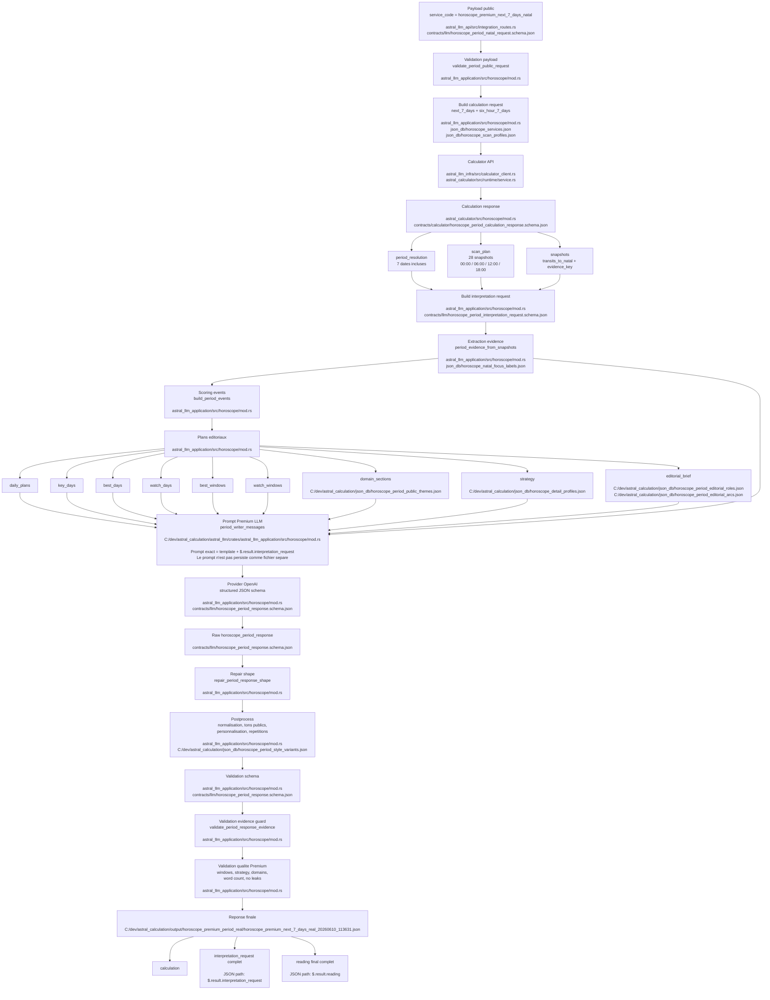

# Generation Horoscope Premium 7 Days - 2026-06-10

Schema Mermaid du flux de generation du service `horoscope_premium_next_7_days_natal`, avec les fichiers principaux impliques.

## Artefacts du run

- Run complet : `C:\dev\astral_calculation\output\horoscope_premium_period_real\horoscope_premium_next_7_days_real_20260610_113631.json`
- Reading final complet : `C:\dev\astral_calculation\output\horoscope_premium_period_real\horoscope_premium_next_7_days_real_20260610_113631.json`, JSON path `$.result.reading`.
- Interpretation request complet du meme run : `C:\dev\astral_calculation\output\horoscope_premium_period_real\horoscope_premium_next_7_days_real_20260610_113631.json`, JSON path `$.result.interpretation_request`.
- Prompt exact envoye au LLM : non persiste comme fichier separe pour ce run. Il est construit par `period_writer_messages` dans `C:\dev\astral_calculation\astral_llm\crates\astral_llm_application\src\horoscope\mod.rs` a partir de `$.result.interpretation_request`.

## Fichiers principaux

- `astral_llm/crates/astral_llm_api/src/integration_routes.rs` : entree HTTP integration et soumission du service.
- `astral_llm/crates/astral_llm_application/src/horoscope/mod.rs` : orchestration, construction des requetes, prompt, repair, postprocess et validations.
- `astral_llm/crates/astral_llm_infra/src/calculator_client.rs` : appel HTTP vers le calculateur.
- `astral_calculator/src/runtime/service.rs` : orchestration runtime du calculateur avec snapshots de transits.
- `astral_calculator/src/horoscope/mod.rs` : calcul period horoscope, snapshots, faits et `evidence_key`.
- `contracts/llm/horoscope_period_natal_request.schema.json` : contrat public d'entree LLM API.
- `contracts/llm/horoscope_period_interpretation_request.schema.json` : contrat de requete interne envoyee au writer LLM.
- `contracts/llm/horoscope_period_response.schema.json` : contrat de sortie de lecture.
- `contracts/calculator/horoscope_period_calculation_request.schema.json` : contrat de requete calculateur.
- `contracts/calculator/horoscope_period_calculation_response.schema.json` : contrat de reponse calculateur.
- `json_db/horoscope_services.json` : declaration du service Premium 7 days.
- `json_db/horoscope_scan_profiles.json` : profil `six_hour_7_days`.
- `C:\dev\astral_calculation\json_db\horoscope_detail_profiles.json` : profondeur Premium, limites de mots et sections activees.
- `C:\dev\astral_calculation\json_db\horoscope_natal_focus_labels.json` : libelles et scenes de personnalisation natale.
- `C:\dev\astral_calculation\json_db\horoscope_period_public_themes.json` : libelles publics, titres de domaines et fenetres.
- `C:\dev\astral_calculation\json_db\horoscope_period_editorial_roles.json` : roles editoriaux des jours.
- `C:\dev\astral_calculation\json_db\horoscope_period_editorial_arcs.json` : arcs editoriaux pour themes repetes.
- `C:\dev\astral_calculation\json_db\horoscope_period_style_variants.json` : variantes de style et termes a eviter.
