# Horoscope V2 Premium Next 7 Days - Processus

> Document historique. Le runtime courant passe maintenant par `IntegrationJobExecutor` ; ce diagramme est conserve uniquement comme trace de migration du flux V1.

Date : 2026-06-12

Service : `horoscope_premium_next_7_days_natal`

```mermaid
flowchart TD
    A["Client submit job\nservice_code = horoscope_premium_next_7_days_natal"]
    --> B["submit_job()\nastral_llm/crates/astral_llm_api/src/integration_routes.rs"]

    B --> C["service_has_v1_orchestrator()\nastral_llm/crates/astral_llm_api/src/integration_routes.rs"]
    C --> D["Job persisted / queued\nJobPersistence APIs\nastral_llm/crates/astral_llm_infra/src/job_persistence.rs"]

    D --> E["Worker loop claims job\nmain()\nastral_llm/crates/astral_llm_worker/src/main.rs"]
    E --> F["IntegrationJobValidator::validate_job()\nastral_llm/crates/astral_llm_application/src/integration_job_validator.rs"]

    F --> G["IntegrationJobExecutor::execute()\nastral_llm/crates/astral_llm_application/src/integration_job_executor.rs"]

    G --> H{"service_code period horoscope ?"}
    H -->|"horoscope_premium_next_7_days_natal"| I["IntegrationJobExecutor::run_period_horoscope()\nastral_llm/crates/astral_llm_application/src/integration_job_executor.rs"]

    I --> J["HoroscopePeriodNatalOrchestrator::execute()\nastral_llm/crates/astral_llm_application/src/horoscope/mod.rs"]

    J --> K["validate_period_service_code()\nastral_llm/crates/astral_llm_application/src/horoscope/mod.rs"]
    K --> L["validate_period_public_request()\nastral_llm/crates/astral_llm_application/src/horoscope/mod.rs"]
    L --> M["build_period_calculation_request_for_service()\nastral_llm/crates/astral_llm_application/src/horoscope/mod.rs"]

    M --> M1["build_period_resolution / scan_plan\nvalidate_scan_plan()\nastral_llm/crates/astral_llm_application/src/horoscope/mod.rs"]

    M1 --> N["CalculatorClient::calculate_horoscope_period_natal()\nastral_llm/crates/astral_llm_infra/src/calculator_client.rs"]

    N --> O["POST /v1/internal/calculations/horoscope/period/natal\ncalculate_horoscope_period_natal()\nastral_calculator_api/src/routes.rs"]

    O --> P["schema_registry.validate('horoscope_period_calculation_request')\nastral_calculator_api/src/routes.rs"]
    P --> Q["ensure_horoscope_natal_chart_ready()\nastral_calculator_api/src/routes.rs"]
    Q --> R["RuntimeService::calculate_horoscope_period_natal()\nastral_calculator/src/runtime/service.rs"]

    R --> S["normalize_horoscope_period_request_utc()\nastral_calculator/src/horoscope/mod.rs"]
    S --> T["repository.positions_for_payload()\nastral_calculator/src/runtime/service.rs"]
    T --> U["repository.natal_input_for_calculation()\nastral_calculator/src/runtime/service.rs"]
    U --> V["repository.active_chart_objects()\nrepository.aspect_definitions()\nrepository.house_system()\nrepository reference loaders\nastral_calculator/src/runtime/service.rs"]

    V --> W["For each scan_plan snapshot:\nephemeris.calculate_natal()\nastral_calculator/src/runtime/service.rs"]

    W --> X["calculate_horoscope_period_natal_from_transits()\nastral_calculator/src/horoscope/mod.rs"]
    X --> Y["real_period_snapshot()\nastral_calculator/src/horoscope/mod.rs"]

    Y --> Y1["nearest_major_aspect()\nperiod_max_major_aspect_orb_deg()\nperiod_theme_for()\nperiod_tone_for()\nnormalize_deg()\nastral_calculator/src/horoscope/mod.rs"]

    Y1 --> Z["HoroscopePeriodCalculationResponse\ncontract_version = horoscope_period_calculation_response\nastral_calculator/src/horoscope/mod.rs"]

    Z --> AA["Calculator API validates response schema\nschema_registry.validate('horoscope_period_calculation_response')\nastral_calculator_api/src/routes.rs"]

    AA --> AB["Back to HoroscopePeriodNatalOrchestrator::execute()\nastral_llm/crates/astral_llm_application/src/horoscope/mod.rs"]

    AB --> AC["period_generation_mode()\nastral_llm/crates/astral_llm_application/src/horoscope/mod.rs"]
    AC --> AD{"generation_mode ?"}

    AD -->|"semantic_brief_v2"| AE["build_period_writer_request_v2()\nastral_llm/crates/astral_llm_application/src/horoscope/mod.rs"]

    AE --> AF["period_service_profile()\nperiod_detail_profile()\nastral_llm/crates/astral_llm_application/src/horoscope/mod.rs"]
    AF --> AG["validate_scan_plan()\nastral_llm/crates/astral_llm_application/src/horoscope/mod.rs"]
    AG --> AH["period_evidence_from_snapshots()\nastral_llm/crates/astral_llm_application/src/horoscope/mod.rs"]
    AH --> AI["build_period_events()\nastral_llm/crates/astral_llm_application/src/horoscope/mod.rs"]
    AI --> AJ["sanitize_writer_v2_evidence()\nastral_llm/crates/astral_llm_application/src/horoscope/mod.rs"]
    AJ --> AK["build_period_semantic_brief()\nastral_llm/crates/astral_llm_application/src/horoscope/mod.rs"]

    AK --> AL["public.normalized_target_language_code()\nastral_llm/crates/astral_llm_application/src/horoscope/mod.rs"]
    AL --> AM["validate_semantic_brief_is_atomic()\nastral_llm/crates/astral_llm_application/src/horoscope/mod.rs"]
    AM --> AN["validate_period_writer_request_v2_schema()\nastral_llm/crates/astral_llm_application/src/horoscope/mod.rs"]

    AN --> AO["period_writer_response_with_quality_loop()\nastral_llm/crates/astral_llm_application/src/horoscope/mod.rs"]

    AO --> AP["period_writer_response()\nastral_llm/crates/astral_llm_application/src/horoscope/mod.rs"]

    AP --> AQ["horoscope_writer_engine_defaults()\nastral_llm/crates/astral_llm_application/src/horoscope/mod.rs"]
    AQ --> AR{"Provider fake ?"}

    AR -->|"yes"| AS["fake_period_writer_response_v2()\nastral_llm/crates/astral_llm_application/src/horoscope/mod.rs"]
    AR -->|"no"| AT["period_response_provider_schema()\nperiod_writer_messages_v2()\nperiod_writer_reasoning_effort()\nperiod_writer_max_output_tokens()\nastral_llm/crates/astral_llm_application/src/horoscope/mod.rs"]

    AT --> AU["ProviderRouter::generate()\nastral_llm/crates/astral_llm_application/src/provider_router.rs"]
    AU --> AV["OpenAI / configured provider adapter\nastral_llm/crates/astral_llm_providers/src/*_adapter.rs"]

    AV --> AW["parse_period_provider_json()\nastral_llm/crates/astral_llm_application/src/horoscope/mod.rs"]
    AW --> AX["repair_period_response_shape_v2()\nastral_llm/crates/astral_llm_application/src/horoscope/mod.rs"]
    AX --> AY["postprocess_period_provider_response_v2()\nastral_llm/crates/astral_llm_application/src/horoscope/mod.rs"]

    AS --> AZ["V2 contract gates"]
    AY --> AZ["V2 contract gates"]

    AZ --> BA["validate_period_response_quality_gates_v2()\nastral_llm/crates/astral_llm_application/src/horoscope/mod.rs"]
    BA --> BB["validate_period_response_contract_gates_v2()\nastral_llm/crates/astral_llm_application/src/horoscope/mod.rs"]
    BB --> BC["schema + dates + evidence_keys + source_snapshot_keys + Premium sections + word count"]

    BC --> BE{"Contract OK ?"}
    BE -->|"yes"| BF["Return response to orchestrator\nHoroscopePeriodNatalOrchestrator::execute()\nastral_llm/crates/astral_llm_application/src/horoscope/mod.rs"]

    BE -->|"no and retries left"| BG["period_style_editor_response_v2()\nastral_llm/crates/astral_llm_application/src/horoscope/mod.rs"]
    BG --> BH["period_style_editor_messages_v2()\nastral_llm/crates/astral_llm_application/src/horoscope/mod.rs"]
    BH --> BI["ProviderRouter::generate()\nastral_llm/crates/astral_llm_application/src/provider_router.rs"]
    BI --> AX

    BE -->|"no and retries exhausted"| BJ["Error HOROSCOPE_PERIOD_V2_QUALITY_FAILED\nastral_llm/crates/astral_llm_application/src/horoscope/mod.rs"]

    BF --> BK["Final V2 contract validation\nvalidate_period_response_contract_gates_v2()\nastral_llm/crates/astral_llm_application/src/horoscope/mod.rs"]

    BK --> BL["Build debug envelope:\ncalculation + interpretation_request + writer_request + reading + period_v2_editorial_audit\nHoroscopePeriodNatalOrchestrator::execute()\nastral_llm/crates/astral_llm_application/src/horoscope/mod.rs"]

    BL --> BM["Worker marks job completed\njobs.mark_completed()\nastral_llm/crates/astral_llm_worker/src/main.rs"]

    BM --> BN["Client polls job\nget_job_status()\nastral_llm/crates/astral_llm_api/src/integration_routes.rs"]

    BN --> BO["Public consumer reads:\n$.result.reading\nV2 internals remain debug-only"]
```

Notes :

- `semantic_brief_v2` est actif uniquement pour `horoscope_premium_next_7_days_natal`.
- La sortie publique attendue reste `horoscope_period_response`.
- `calculation`, `interpretation_request`, `writer_request`, `semantic_brief`, `evidence` et diagnostics qualite sont des donnees internes/debug ; les consommateurs UI doivent lire `$.result.reading`.
- Le chemin `semantic_brief_v2` ne bloque plus sur des mots, fragments ou phrases hardcodes dans le texte public. Ces signaux appartiennent a `debug.period_v2_editorial_audit`, en mode `non_blocking`.
- Le retry editor V2 est declenche uniquement par une erreur contractuelle : schema, dates, evidence, snapshots, sections Premium, coherence des fenetres ou word count provider reel.
