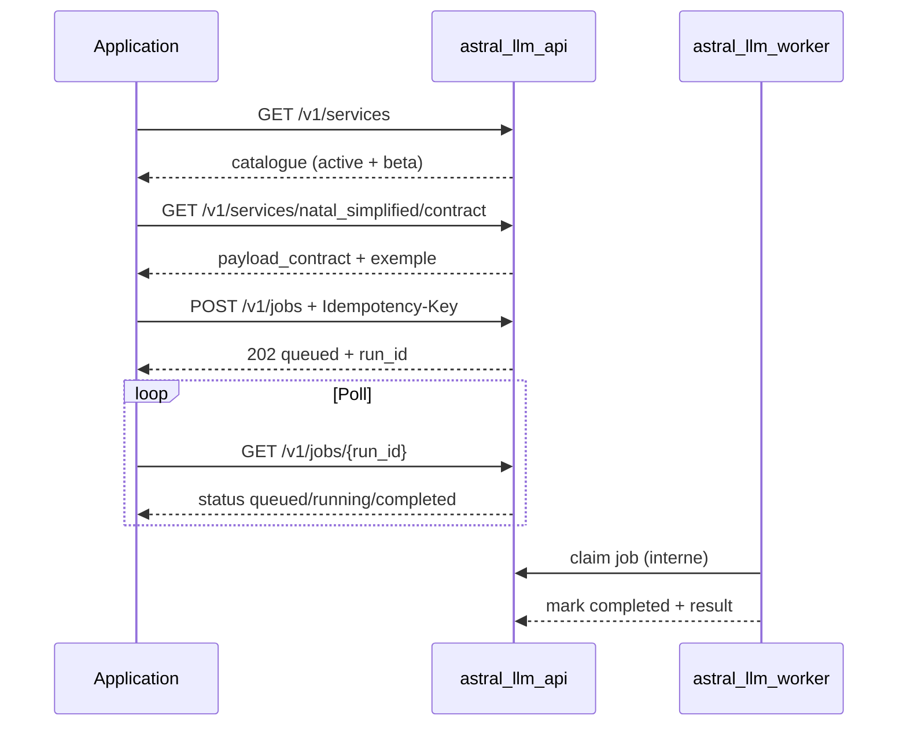

# Guide intégrateur — API d'intégration

Guide pratique pour connecter une application externe à `astral_llm_api`. Contrat normatif : [integration_api_contract.md](integration_api_contract.md).

## Démarrage rapide (Docker local)

```powershell
docker compose up -d --build
python scripts/import_json_db_to_postgres.py
.\scripts\manage_integration_services.ps1 -Submit
docker compose up -d astral_llm_worker
```

- Calculateur : `http://localhost:8080`
- LLM API : `http://localhost:8081`
- Worker : traite les jobs `queued` en arrière-plan

Smoke intégration : `.\scripts\test_integration_jobs_e2e.ps1`

## Flux recommandé



## 1. Découvrir les services

```http
GET /v1/services
```

Liste les services `active` et `beta`. Ajouter `?include=planned` pour voir la feuille de route.

Champs utiles : `service_code`, `availability`, `calculation_mode`, `supports_async`, `supports_mercure`, `contracts.payload`.

## 2. Lire le contrat métier

```http
GET /v1/services/natal_simplified/contract
```

Retourne `payload_contract`, liens schémas, `example_request`, notes de validation.

## 3. Soumettre un job

```http
POST /v1/jobs
Idempotency-Key: my-unique-key-001
X-Tenant-Id: acme-corp
Content-Type: application/json
```

```json
{
  "service_code": "natal_simplified",
  "payload": {
    "request_contract_version": "astro_simplified_natal_request_v1",
    "birth": {
      "date": "1990-06-15",
      "time": "14:30",
      "timezone": "Europe/Paris",
      "location": { "latitude": 48.8566, "longitude": 2.3522 }
    }
  },
  "user_language": "fr",
  "audience_level": "beginner"
}
```

Réponse **202** :

```json
{
  "run_id": "550e8400-e29b-41d4-a716-446655440000",
  "status": "queued",
  "service_code": "natal_simplified",
  "poll_url": "/v1/jobs/550e8400-e29b-41d4-a716-446655440000",
  "poll_after_ms": 2000
}
```

## 4. Suivre le job

```http
GET /v1/jobs/550e8400-e29b-41d4-a716-446655440000
```

Respecter `poll_after_ms`. Statut terminal `completed` inclut `result` (enveloppe calcul + lecture).

## Idempotence — bonnes pratiques

- Une clé par intention métier (commande, panier, etc.)
- **Ne jamais réutiliser** la même clé pour un autre `service_code`
- Replay `completed` → **200** avec `result` (pas besoin de re-poller)

## Services disponibles (V1)

| service_code | Mode | Statut catalogue |
|--------------|------|------------------|
| `natal_simplified` | birth → calcul simplifié → lecture | **active** |
| `natal_basic` | birth → moteur complet → lecture basic | **active** (Phase 3) |
| `natal_*_from_payload` | payload pré-calculé | planned |
| `natal_light`, `natal_premium`, `natal_premium_plus` | full natal | planned (activation progressive) |
| `horoscope_premium_daily_local_2h_slots` | horoscope quotidien local 12 créneaux | **beta** |
| `horoscope_basic_next_7_days_natal` | horoscope Basic des 7 prochains jours | **beta** |
| `horoscope_premium_next_7_days_natal` | horoscope Premium des 7 prochains jours | **beta** |

### Horoscope Premium quotidien local

Le service Premium utilise `POST /v1/jobs`, comme Free et Basic. Il requiert un
theme natal deja calcule via `chart_calculation_id`, une timezone IANA et une
localisation de reference. La timezone decoupe les 12 creneaux locaux ; la
localisation sert au calcul du ciel local, de l'Ascendant, du MC et des maisons
locales.

```json
{
  "service_code": "horoscope_premium_daily_local_2h_slots",
  "payload": {
    "date": "2026-06-06",
    "timezone": "Europe/Paris",
    "target_language": "fr",
    "chart_calculation_id": "123",
    "location": {
      "latitude": 48.8566,
      "longitude": 2.3522,
      "label": "Paris"
    },
    "detail_level": "premium_rich"
  },
  "user_language": "fr",
  "audience_level": "beginner"
}
```

Si `location.label` est absent, la reponse ne doit pas inventer de ville. La
sortie Premium contient exactement 12 entrees de timeline, ordonnees selon le
profil horaire public.

### Horoscope Basic 7 prochains jours

Le service period utilise `POST /v1/jobs`. Il requiert un theme natal deja
calcule via `chart_calculation_id`, une timezone IANA et une `anchor_date`
interpretee comme date civile locale.

```json
{
  "service_code": "horoscope_basic_next_7_days_natal",
  "payload": {
    "anchor_date": "2026-06-07",
    "timezone": "Europe/Paris",
    "target_language": "fr",
    "chart_calculation_id": "123",
    "audience_level": "general"
  }
}
```

La sortie `horoscope_period_response_v1` contient une vue de periode :
`week_overview`, `key_days`, `best_days`, `watch_days`, `daily_timeline[7]`,
`domain_sections`, `advice`, `evidence_summary` et `quality`. Le payload public
ne fournit pas `period_profile_code`, `detail_profile_code` ou
`scan_profile_code`; ces profils viennent du catalogue service.

Les sorties period exposent des dates UTC normalisees (`+00:00` ou `Z`) et des
libelles publics francais. Les codes internes (`theme_code`, `period:`,
`natal_`, `transit_exact`, `transit_active`, etc.) restent dans les payloads
internes ou les champs de preuve, pas dans les textes publics.

### Horoscope Premium 7 prochains jours

Le service Premium period reutilise le meme payload public que le Basic period,
mais le catalogue impose `detail_profile_code = premium_rich` et
`scan_profile_code = six_hour_7_days`.

```json
{
  "service_code": "horoscope_premium_next_7_days_natal",
  "payload": {
    "anchor_date": "2026-06-07",
    "timezone": "Europe/Paris",
    "target_language": "fr",
    "chart_calculation_id": "123",
    "audience_level": "general"
  }
}
```

Difference produit :

| Basic period | Premium period |
| --- | --- |
| `daily_noon_7_days` | `six_hour_7_days` |
| 7 snapshots | 28 snapshots |
| `best_days` / `watch_days` | days + `best_windows` / `watch_windows` |
| domaines synthetiques | 3 a 5 domaines enrichis |
| conseil global | strategie de semaine |

Chaque window Premium reference `source_snapshot_keys`. `best_days` et
`watch_days` restent des dates globales ; `best_windows` et `watch_windows`
localisent des plages horaires. Le profil `premium_rich` vise 2200 mots et
bloque au-dela de 3200 mots.
`best_days` Premium retourne jusqu'a 3 dates, sans forcer une troisieme date
faible : deux dates sont valides si seules deux ressortent clairement apres
scoring, deduplication et exclusions.

Pour Premium V1.1, `watch_summary.status = low` represente une vigilance douce :
pas de tension forte, mais 1 a 3 `watch_windows` prudentes, evidencées et sans
overlap avec `best_windows`. `watch_days` reste vide dans ce cas car il ne
signale que les journees de vigilance forte. `status = none` reste reserve aux
cas sans signal exploitable.

## Mercure (optionnel)

Si `supports_mercure: true` sur le service, s'abonner au topic :

```text
tenants/{tenant_id}/jobs/{run_id}
```

Hub local Docker : `http://localhost:3000/.well-known/mercure`

## Legacy vs intégration

| Besoin | Route |
|--------|-------|
| Orchestration manuelle calcul + lecture | `POST /v1/calculations/natal` puis `POST /v1/readings/generate` |
| Sync one-shot simplified | `POST /v1/readings/natal/simplified` |
| **Intégration async certifiée** | `POST /v1/jobs` |

Voir [contracts/README.md](../contracts/README.md) pour la matrice complète.

## Scripts utiles

| Script | Rôle |
|--------|------|
| `manage_integration_services.ps1 -List` | Catalogue en base |
| `test_integration_jobs_e2e.ps1` | E2E natal_simplified async |
| `test_natal_from_birth_e2e.ps1` | E2E full natal via jobs |
| `test_horoscope_period_all.ps1` | Suite fake + contrats horoscope period |
| `test_horoscope_basic_next_7_days_real_e2e.ps1` | E2E reel optionnel horoscope period |
| `test_horoscope_premium_next_7_days_real_e2e.ps1` | E2E reel optionnel horoscope period Premium |

## Erreurs fréquentes

| Symptôme | Cause | Action |
|----------|-------|--------|
| 404 SERVICE_NOT_FOUND | Service `planned` ou code invalide | `GET /v1/services?include=planned` |
| 409 IDEMPOTENCY_CONFLICT | Clé réutilisée autre service/payload | Nouvelle clé |
| 422 PAYLOAD_VALIDATION_FAILED | Payload ≠ contrat ou gate profil | `GET .../contract` |
| Job reste `queued` | Worker arrêté | `docker compose up -d astral_llm_worker` |
| 404 JOB_NOT_FOUND au poll | Mauvais tenant ou clé API | Mêmes headers qu'à la soumission |
